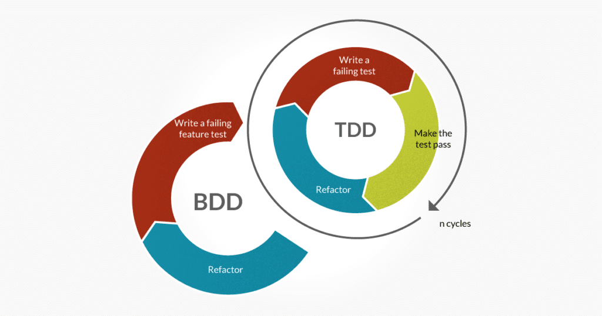

# Automated Testing

## Why should we automate tests?
- Lifts the burden of manual testing from the QA & QE
- Early feedback & detection of errors from Engineer’s development machine provides confidence for making changes to the source code
- Combined with Continuous Integration, automated tests vastly reduce the cycle time in Software Development Life Cycle by correctness guarantees with frequent feedbacks
- Test suites serve as a great source of truth and documentation for other Engineers who will maintain the code (including yourself in the future)

## Types of tests
- Unit Test
- Component Test
- Integration Test
- End-to-end Test (E2E)

> Keep in mind that, other than Unit Test which its meaning is fairly ubiquitously understood, many terminologies are overloaded and confusions can arise from people using different names to refer to the same type of test or using the same name to refer to different types of tests. It's important to be clear in communication when discussing matters in this space.

### Unit Test
- “Unit Testing is a level of software testing where individual smallest units of an application is tested” - in general, this means testing functions and methods in the code
- Typically read, written and implemented by Software Engineers

### End-to-end Test (E2E)
- Tests the end-to-end flow of a specific feature in a system
  - Registration flow of a new user
  - Make a balance transfer in an online banking system
  - Place an order in an E-commerce system
- Typically implemented by Software Engineers, but can be read and written by various other members of the team such as Product Owner, Business Analysts and Quality Assurance Engineers

## Test Driven Development (TDD)
- Coding practice that aims to ennsure high test coverage and testability of your code
- The high-level workflow:
  1. Write a set of unit tests that set out the requirements of a function
  2. Implement the function that will pass the tests in step 1.
  3. Repeat the process
- Testable code is often more **reusable, adaptable and maintainable**

### Is TDD enough?
Having high coverage of unit tests over your code may provide confidence that each of your functions will behave correctly to meet its own narrow scope of requirement, but it may not necessarily all fit together to form a unified working application that meet the business requirement

## Behaviourt Driven Development (BDD)
- Often tied to E2E testing of features of your system
- Encourages collaboration of Software Engineers, QAs and the Product Owner
- Can serve as the **contract** your system should abide by
- Breaking this contract will mean your system is not functioning to meet the expectation of the user

### Format of BDD - User Story
Popular approach to present the E2E test is to follow the user stories in a 'Given, When, Then' format
- Given - Context
- When - Event
- Then - Outcome

#### Example for an ATM system
- **Given**
  - The user inserts a valid card
  - The account balance is £100
  - The machine holds enough cash
- **When**
  - The user requests to withdraw £40
- **Then**
  - The machine should dispense £40
  - The account balance should be £60
  - The card should be returned

## TDD vs BDD
- Failing E2E test typically signals *something* is wrong with the system, but it often doesn’t tell you *what* is wrong
- Failing unit tests may sometimes be false positives
- TDD and BDD need not be adversaries, they complement each other to help you build a robust system
- E2E tests will ensure your system abides by the **contract**, and unit tests will help you pinpoint **what is wrong**

