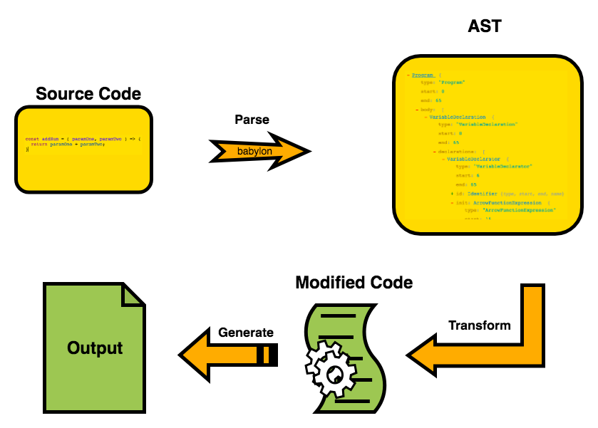

# Babel
{: .no_toc }

Presented on 27th June 2020 by [Jung](https://github.com/junglee1101)
## Table of contents
{: .no_toc .text-delta }

1. TOC
{:toc}

## Babel
----

### What is Babel?
- Babel is a **JavaScript transpiler** that converts ES6+ into plain ES5 JavaScript that can be understandable to every browsers. 
This process is known as **source-to-source compiling**, also known as **transpiling**.

- Babel comes packaged as an node module so it can be installed via npm. 

- Babel has support for syntax extensions such as the JSX syntax for React.

- Anyone can create their own plugins or use presets that are pre-determined for specific transpilation. 

### Stages of Babel

(src:[Imran Sayed's blog](https://imranhsayed.medium.com/introduction-to-babel-28da5af7e056))

- Babel is built on a plugin system that parses JS code into an [AST(Abstravt Syntax Tree)](https://en.wikipedia.org/wiki/Abstract_syntax_tree) and rewrites into a version that can be interpreted by the browser. 

- There are 3 primary stages of Babel which are **parse, transform, generate.**

1. **Parse**

There are two phases of parsing in Babel: **Lexical Analysis** and **Syntatic Analysis**. 

- **Lexical Analysis** 
It will take code and turn it into a stream of tokens. you can think of token as a array of language syntax pieces. 

- **Syntactic Analysis** 
It will take a stream of tokens and turn it into an AST representation. Using the information in the tokens, this phases will reformat them as an AST which represents the structure of the code in a way that make it easier to work with. 

2. **Transform**

The Transform stage takes an AST and traverses through it, adding, updating, and removing nodes as it goes along. This is where plugins operate. 

3. **Generate** 

The generation stage takes the final AST and turn it back into a string of code, also creating source maps. 

### Presets 
- Babel presets act as sharable set of Babel plugins and/or config options. Few presets for common environments are as follow: 
    - `@babel/preset-env` for compiling ES2015+ syntax
    - `@babel/preset-typescript` for **TypeScript**
    - `@babel/preset-react` for **React**
    - `@babel/preset-flow` for **Flow**

- Presets can take options in the configuration files. There are two types of config files which are as follow;

    - babel.config.js (Project-wide configuration) 
    - .babelrc (File-relative configuration)
    - More detail explanation can be found [here](https://babeljs.io/docs/en/config-files#file-relative-configuration)

### .babelrc

In .babelrc configuration file, you can specify 
- Plugins and presets 
- Which files to ignore 
- Different settings for different targets 

In configuration file, module can be set to false which let the modules to be handled by webpack. Babel then only include the code for a function that are used from the node_modules and the rest will be taken care by Webpack. This is called **tree shaking** or **live code inclusion** 

### Polyfill

- In order for certain features to work on browser, it requires certain polyfill by using `@babel/polyfill`. 

- For example, If you are using an environment that doesn't support ES5 (e.g.lower version of IE), using `@babel/polyfill` can solve the issue to 'fill in' the gap and add missing implementations. 

## Resources 
1. [Introduction to Babel](https://imranhsayed.medium.com/introduction-to-babel-28da5af7e056)
2. [Babel Doc](https://babeljs.io/docs/en/)
3. [Babel Plugin Handbook](https://nicedoc.io/thejameskyle/babel-handbook/translations/fa-IR/plugin-handbook.md)
4. [Revealing the magic of AST](https://dev.to/viveknayyar/revealing-the-magic-of-ast-by-writing-babel-plugins-1h01)