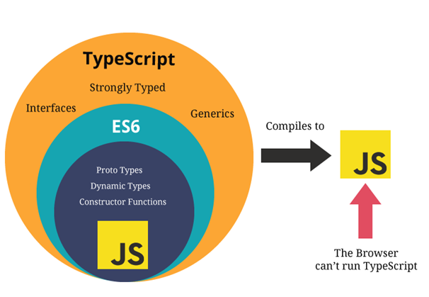

# TypeScript I
{: .no_toc }

Presented on 26/04/2021 by [Jung](https://github.com/junglee1101)
## Table of contents
{: .no_toc .text-delta }

1. TOC
{:toc}

## Why TypeScript?
----
### TypeScript 

(source:[twitter](https://mobile.twitter.com/ahejlsberg))

**Anders Hejlsberg**, author of Turbo Pascal and lead architect of C# at Microsoft, gave a tech talk on Typescript at [TSConf 2019 keynote](https://www.youtube.com/watch?v=jmPZztKIFf4). Typescript is a strict superset of Javascript that adds optional static typing and object-oriented constructs.

- The complexity of the JavaScript project codebase tends to grow exponentially with each new code line, making it difficult to maintain on the enterprise level. The increasing popularity of JavaScript on the server made things worse and that’s when Microsoft created TypeScript to solve this issue.

- Because Typescript aligns with ECMAScript 6, it offers a partial “preview” of the future of Javascript development. Best of all, Typescript is open sourced and available on Github under the Apache license.

> TypeScript is a strongly typed superset of JavaScript which compiles to plain JavaScript.

(source:[Vishnupriya's Medium page](https://medium.com/@vishnupriya_web/what-is-typescript-faa0890b2baf))

### JavaScript 

- It was developed by **Brendan Eich** in 1995 for the Netscape browser in 10 days. It was supposed to be a scripting language to add dynamic behaviour to the web page.

- Many other browsers such as Internet Explorer adopted this language but with a different flavor of their own. That’s why it was needed to be standardized. The first official version of JavaScript (ES1) was released by ECMAScript back in 1997.

- JavaScript is not a statically typed language which means the data types are evaluated at runtime.

For example, if you declare a variable `var x = 1;`, the type of the variable `x` will be `number` at runtime but you can also assign a new value to it of a different type such as a `string`, for example `x = 'hello'`. This behaviour can cause a lot of issues if we are not being careful.

- The odd behaviours of JavaScript are presented by **Gary Bernhardt** from [CodeMash 2012](https://www.destroyallsoftware.com/talks/wat) and by **Brian Leroux** from [dotJS 2012](https://www.youtube.com/watch?v=et8xNAc2ic8).

## Pros and Cons
----

### Pros 

- **Optional static typing** 

TypeScript introduces optional strong static typing. Once declared, a variable doesn’t change its type and can take only certain values. The compiler alerts developers to type-related mistakes, so they have no opportunity to hit the production phase. This results in less error-prone code and better performance during execution.

- **Early spotted bugs** 

It gives the code more structure, makes it self-documenting and more readable, speeds up debugging and refactoring.

- **Predictability** 

With TypeScript, everything stays the way it was initially defined. If a variable is declared as a string, it will always be a string and won’t turn into a Boolean. This enhances the likelihood of functions working the way initially intended.

- **Readability and Maintainability** 

Due to adding strict types and other elements that make the code more self-expressive (so-called syntactic sugar), you can see the design intent of developers who originally wrote the code. It’s especially important for distributed teams working on the same project. A code that speaks for itself can offset the lack of direct communication between team members.

### Cons 

- **Not true static typing** 

TypeScript will eventually transpile into untyped JavsScript, so there is always the risk of weird type conversions at runtime.

- **One more Language to learn**

As TypeScript is a superset of JavaScript, you have to learn JavaScript in order to code in TypeScript.

- **Bloated code**

Due to syntatic suger and type annotations, developers have to write more code which potentially slow down the development process. 

- **Additional step - transpiling**   

As browsers can't interperet the TypeScript code, it needs to be transpiled to JavaScript before running. However, this step is pretty insignificant. 

## Common types of values 
----

### The Primitives 

- **Boolean**: two values, `true` or `false` 
- **Number** : number like `1`
- **String** : string values like `"Hello world"`

### Arrays
- A list of value like `[1, 2, 3]`
- The syntax of the above is `number[]`
- It can also be written as `Array<number>`

### Any
It can be used for any types - can be used whenever you don't want a particular value to be type-checked. This `any` type is useful when you just want to pass the particular line of code. However it is best to avoid using using as `any` isn't type-checked. you can use `noImplicitAny` to flag any implicit `any` as an error.

### Functions 

- **Parameter Type annotation**
You can add type annotations after each parameter to specify what type of parameters the function can accept. By declaring the parameter types, arguments to that function will be checked when the function is used. 

- **Return Type Annotation** 
You can also add expected return type to the function. Return type annotations appear after the parameter list `:`. You usually don’t need a return type annotation because TypeScript will infer the function’s return type based on its return statements.

### Object Types 

- JavaScript value with properties - To define an object type, we list its properties and their types. 

- Optional properties can also be specify by adding `?` after the property name.

### Union Types 

- When a value can accept more than one type. You can specify additional type by adding `|` between different types like `number | string`.

### Type Aliases 

- If object types and union types are used more than once, you can use a **type alias**.

### Interfaces

- An interface is another way to name an object type.

- The difference between `Type Aliase` and `Interface` is that Interface is extendable whilst Type Aliase cannot be re-opened to add new properties. 

### Null and undefined

- JS have two primitive values to represent absent or uninitilised value - null and undefined.

- `strictNullChecks` is used to to strictly check the empty value. If it is set to `false`, both types are ignored by the language which can cause unexpected errors at runtime. When it is set to `true`, you'll get a type error when you use them where a concerete value is expected. 

**Non-null Assertion Operator** 

TypeScript also has a special syntax for removing null and undefined from a type without doing any explicit checking. Writing `!` after any expression is effectively a type assertion that the value isn’t null or undefined. Only use this if you are certain that the value won't be null or undefined. 

### Enums 
- Enums, or Enumerated types, are data structures of constant length that hold a set of constant values.

- TypeScript translates enums into JavaScript objects in the final code emitted by the compiler. Because of this, you can use enums to make a codebase more readable, as you can have multiple constant values grouped in the same data structure, while also making the code more type-safe than just having different const variables laying around.

## Resources 
1. [TypeScript Docs](https://www.typescriptlang.org/docs/handbook/2/basic-types.html)
2. [History of the TS](https://medium.com/jspoint/typescript-a-beginners-guide-6956fe8bcf9e)
3. [TypeScript Pros and Cons](https://www.altexsoft.com/blog/typescript-pros-and-cons/)