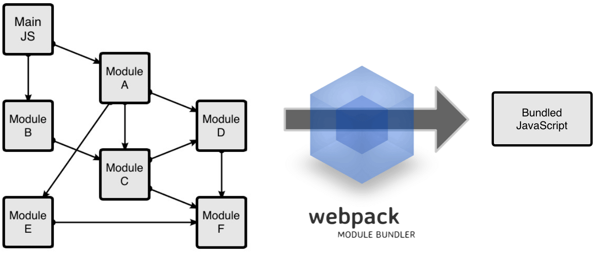
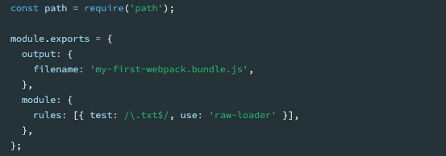
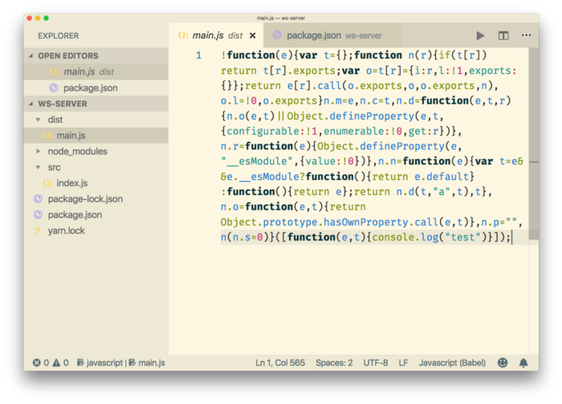
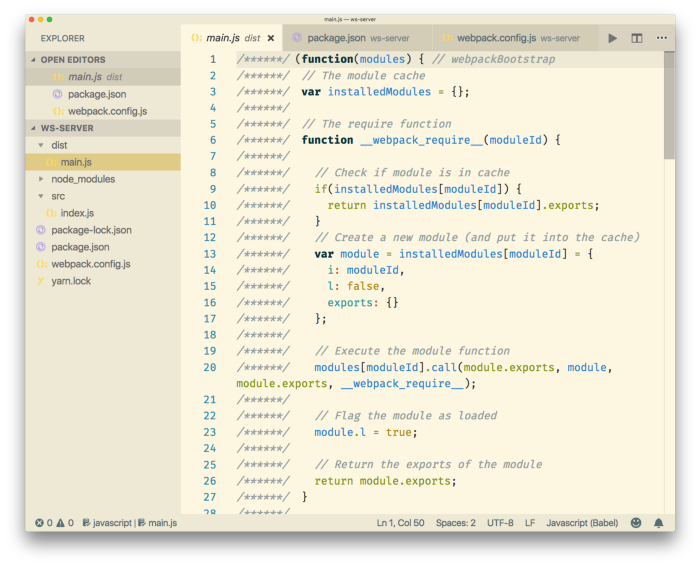

# Webpack
{: .no_toc }

Presented on 27th June 2020 by [Jung](https://github.com/junglee1101)
## Table of contents
{: .no_toc .text-delta }

1. TOC
{:toc}

## What is Webpack?
----
(src: [Mkrtich Sargsyan's blog](https://medium.com/geekculture/webpack-101-a-quick-look-at-webpack-and-its-uses-22ff598723a9))

- Webpack is a static module bundler for modern JavaScript applications according to the webpack doc. 

- Webpack can minifies the file depending on the environment that you use(development or production). This will also reduce file size which can increase performance. 

- Webpack places all your code in one javascript file. 

## Core Concepts 
----
### [Entry](https://webpack.js.org/concepts/entry-points)

An entry point indicates which module webpack should use to begin building out its [internal dependency graph](https://webpack.js.org/concepts/dependency-graph/). 

### [Output](https://webpack.js.org/concepts/output)

Specify where to emit the bundles that webpack created and how to name these files. The default it set to `.dist/main.js` for the main output file and to the `.dist` folder for other generated file. 

### [Loaders](https://webpack.js.org/concepts/loaders)

Loaders allow webpack to process other types of files other than JavaScript and JSON(e.g. css, html and image files). Loaders will convert them into valid modules that can be added to the dependency graph. 

Loaders have two properties in webpack configuration. 
1. The `test` property to specify which file to transform
2. The `use` property to specify which loader should be used to transform the module

(src: [Webpack doc](https://webpack.js.org/concepts/#entry))

- The above example indicates that if webpack compiler come across a path that resolves to a '.txt' file inside of a `require()` or `import` statement, use the `raw-loader` to transform the file before webpack add it to the bundle. 

### [Plugins](https://webpack.js.org/api/plugins)

Plugin performs a wider range of tasks such as bundle optimisation, asset management and injection of environment variables. 

- To use a plugin, you need to `require()` it and add it to the plugins array. As puglin can be used multiple times in a configuration for a different purposes, you need to create an instance of it by using `new` operator. 

- For example, `HtmlWebpackPlugin` generates an HTML file for the application and injects all the genereated bundles into a file. 

- Plugins list can be found [here](https://webpack.js.org/plugins/).

### [Mode](https://webpack.js.org/configuration/mode)

- Specify the environment - either `development` and `production`.
- The default value is `production`.
- The table below shows the difference between two mode. 

| Development mode                                     | Production mode                                 |
|------------------------------------------------------|-------------------------------------------------|
| Builds very fast                                     | Slower to build                                 |
| Is less optimised than production                    | Smaller in size                                 |
| Does not remove comments                             | Remove things that are not needed in production |
| Provide more detailed error messages and suggestions |                                                 |
| Provide a better debugging experience                |                                                 |

#### The snippet of production bundle

(*src: Resource 2*)

#### The snippet of development bundle

 

(*src: Resource 2*)
## Resources 
1. [Webpack Doc](https://webpack.js.org/)
2. [Webpack introduction](https://medium.com/free-code-camp/a-beginners-introduction-to-webpack-2620415e46b3)