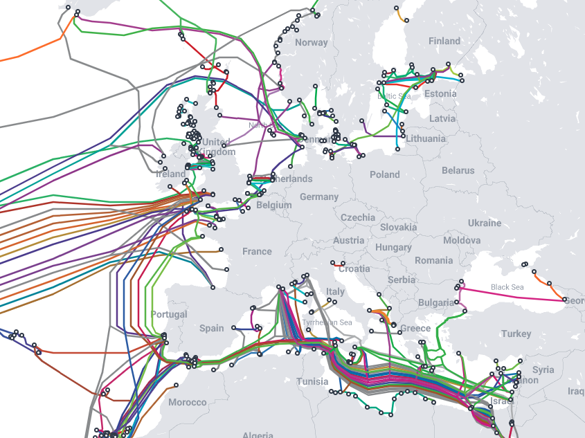
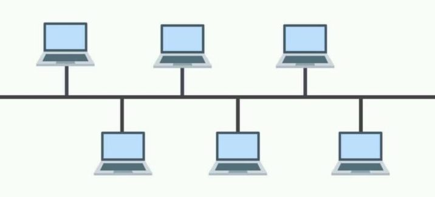
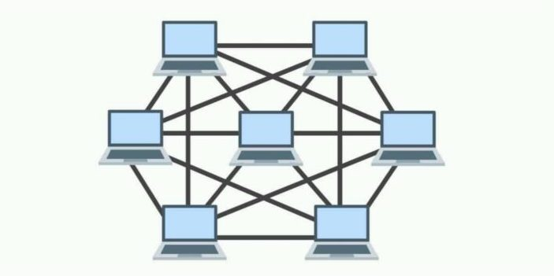
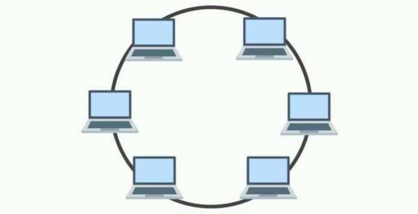
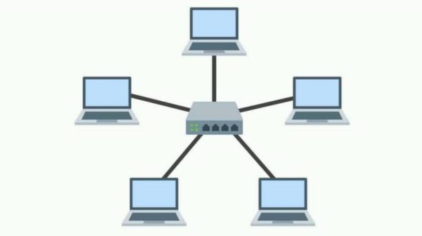
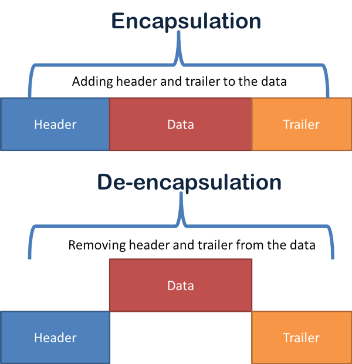
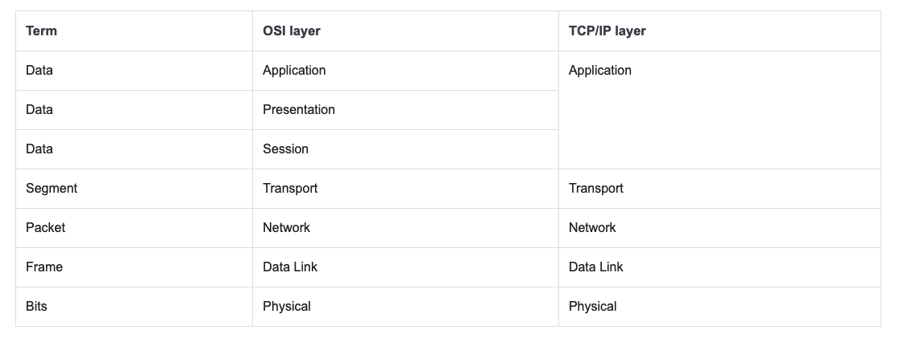

# Network
{: .no_toc }

Presented on 26th July 2020 by [Jung](https://github.com/junglee1101)
## Table of contents
{: .no_toc .text-delta }

1. TOC
{:toc}

## What is Network?
----
A **network** is a collection of computers, servers, mainframes, network devices, peripherals, or other devices connected to allow data sharing. An example of a network is the Internet, which connects millions of people all over the world. Internet stands for International Network. 

## Type of Network - LAN, WAN, MAN, WLAN and PAN
----

| LAN (Local Area)                                                    | WAN (Wide Area)                                             |
|---------------------------------------------------------------------|-------------------------------------------------------------|
| Limited in size / geographical area                                 | One large network that covers a large geographic area       |
| Can be as small as a single room or big as a building               | Internet- best known WAN                                    |
| Normally uses twisted pair cabling to connect devices (CAT/ CAT 6A) | Can be many smaller networks linked into one large one      |
| LAN nodes tied together with switches or hubs                       | Called an enterprise network when owned by one organisation |
| Can use fibre optic cables to connect switches                      | Use routers and switches to connect up network              |

This below diagram shows how WAN cable is connected globally under the sea. 

*(src: Resource(1))*

| MAN(Metropolitan Area)                                      | WLAN(Wireless Local Area)      |
|-------------------------------------------------------------|--------------------------------|
| Use same technology as WANs but cover smaller area than WAN | Wireless technologies          |
| Covers an area of only 50 km or so across                   | Defined by IEEE 802.11 standard|
| Term falling out of use                                     |                                |
| Term WAN used to apply to both WANs and MANs                |                                |

| PAN(Personal Area)                                                      |
|-------------------------------------------------------------------------|
| Defined by IEEE 802.15 standard group                                   |
| Primarily uses Bluetooth technologies for connecting                    |
| Limited range of less than 30 feet                                      |
| Take off less power than wireless                                       |
| Devices like keyboards and mice can use PANs to connect to a computer   |
| Many phone use PANs to connect accessories (e.g. earbuds, smartwatches) |
| PANs can also use Infrared signal instead of bluetooth                  |

## Network Topologies
----

### Bus Topology

*(src: Resource(2))*

The bus topology is an older topology. All devices are connected together using a single cable, which is call a trunk, backbone, or segment. Compute are connected to the bus cable by drop line and taps. A drop line is a connection running between the device and the main cable. That Backbone cable has terminator on both side for prevent signal loss.

It’s becomes weaker if it travel a long distance. For this reason there is a limit on the number of taps a bus can support. 

The main advantage of bus topology is easy of installation and cost and it uses less cable than a star topology or a mesh topology. 

However, it is difficult to know the problem if the network goes down and when it does, it is usually due to a break in the backbone cable segment. Also it is not scalable due to traffic issue. Moreover, the efficiency decreases rapidly with additional node to the bus topology. 
 
### Mesh Topology

*(src: Resource(2))*

Mesh topology link multiple network between computer to provide multile paths for data to travel. 

It is fault tolerance as there are many connections between computers. so if one cable breaks, another can be used for data transmission. 

As Mesh topology uses more cable, it is very expensive. Moreover, it is harder to manage as there are so many connections compare to other topologies.

### Ring Topology

*(src: Resource(2))*

In a ring network, every device has exactly two neighbours for communication purposes. All messages travel through a ring in the same direction. 

The advantage of ring topology is that data degeneration is very low. however, if one system is down or the cable is broken, the entire network could go down. 

### Star Topology

*(src: Resource(2))*

Each device has a dedicated point-to-point link to a central controller device, usually knoen as a switch or hub. When a computer sends data to other computers on the network, it is sent along the cable to the bub or switch, which can then pass the packets to the computer or devices connected to it.

The main advantage of this topology is that it is robust. If one link fails, it doesn't effect the others. This means that it is easy to identify the network problems. Also it is highly scalable and easy to add another system to the network. Moreover, it is easy to manage to monitor of network traffic. Although it has many advantages, if the central hub fails, the entire network will go down. so there is a central point of failure. 

## TCP/IP Model vs OSI model 
----

**TCP/IP** and **OSI** are the two most widely use networking models for communication. There are some similarities and differences between them. One of the major difference is that **OSI** is a conceptual model which is not practically used for communication, whereas, **TCP/IP** is used for establishing a connection and communicating through the 
network.

TCP/IP stands for **Transmission Control Protocol/ Internet Protocol**. It is a communication protocol that allows for connections of hosts to the internet. It is specifically designed as a model to offer highly reliable and end-to-end byte stream over an unreliable internetwork.

*(src: Resource(3))*

The OSI Model is a logical and conceptual model that defines network communication used by systems open to interconnection and communication with other systems. The **Open System Interconnection** (OSI Model) also defines a logical network and effectively describes computer packet transfer by using various layers of protocols.

### Data Encapsulation 

- Encapsulation is a process in which protocol information is added to the data. 

- De-encapsulation is a process in which information added through the encapsulation process is removed.

- Protocol information can be added before and after the data. If the information is added before the data, it is known as a **header**. If the information is added after the data, it is known as a **trailer**.

*(src: Resource(4))*

- The header and trailer added by a layer on the sending computer can only be removed by **the peer layer on the receiving computer**. 

- Data encapsulated by a layer on the sending computer is de-encapsulated by the same layer on the receiving computer. This process is known as **the same layer interaction.**

- After doing the encapsulation, each layer uses a specific name or term to represent the encapsulated data.

- The below table shows the terms/units used by the layers in both models to represent the encapsulated data.

*(src: Resource(4))*

The below diagram shows how data is encapsulated and decapsulated in the TCP/IP model.

*(src: Resource(4))*

### Eternet (layer 2)

- Every network device has a unique physical identity that is assigned by the manufacturing vendor is called MAC address or Ethernet address. 

- The mac address is also known as the hardware address while the IP address is the logical address of the device. The mac address is defined in the Hexa-decimal format generally. It consists of 6 byte (48 bits) where the first three bytes are used as the identity of the vendor and the last three bytes are used as the node identity. The mac address works on the mac sub-layer of the data link layer of the OSI model.

### IP (layer 3)

- IP, Internet Protocol is the standard for routing packets across interconnected networks. The format of an IP packet is documented in RFC 791. The most significant aspect of the IP protocol is the addressing: every IP packet includes the IP source address (where the packet is coming from) and the IP destination address (where the packet is heading to).

- An **IPv4** address (Internet Protocol version 4) comprises four sets of numbers, each ranging from 0 to 255, which are separated by periods. IPv4 is the current standard for IP addresses in the TCP/IP model, while IPv6 is a newer IP version on the rise.

- **IPv6** address (Internet Protocol version 6), was first introduced in the late 1990s as a replacement for IPv4. It uses **128-bit addresses** formatted as eight groups of four hexadecimal numbers separated by colons. IPv6 is the solution that addresses the relatively limited number of IP addresses possible under IPv4. Under IPv6, there will no longer be a shortage of the total number of possible addresses.

## Resources 
1. [WAN cable](https://www.submarinecablemap.com/)
2. [Network Topologies](https://utechnoworld.com/what-is-bus-topology-in-network-topology/)
3. [OSI Model](https://community.fs.com/blog/tcpip-vs-osi-whats-the-difference-between-the-two-models.html)
4. [Data Encapsulation](https://www.computernetworkingnotes.com/ccna-study-guide/data-encapsulation-and-de-encapsulation-explained.html)