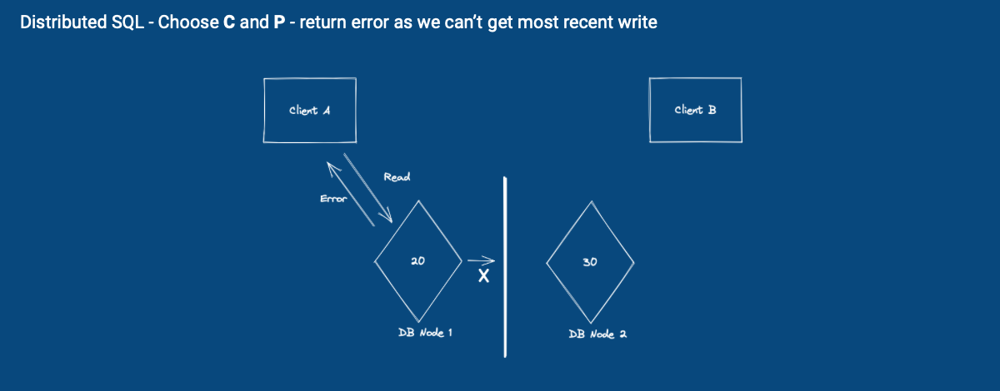
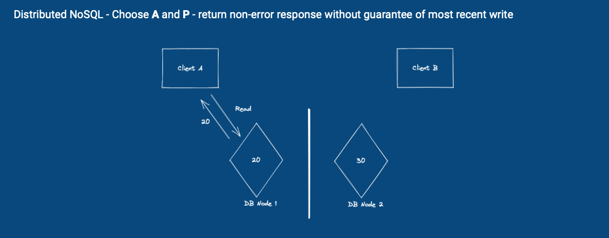

# Distributed Data store, SQL and NoSQL
{: .no_toc }

## Table of contents
{: .no_toc .text-delta }

1. TOC
{:toc}

## NoSQL Database

### What really is NoSQL?

Technically, it means any database systems that are *not* SQL database - therefore they include many different types of database system: 
- Key Value DB
- Document DB
- Columnar DB
- Graph DB

In practice, NoSQL is typically used to refer to database systems that handle data primarily as document data structure such as DynamoDB, MongoDB, and Cassandra to name a few.

## The need for distributed system

> "**Distributed System** - *A system whose components are located on different networked computers*” - Wikipedia

Distributed system is commonplace nowadays, accelerated in the recent few decades with the rise of the internet and ubiquity of devices that are capable of connecting to the internet. A system consisting of a single server is generally not able to provide fault tolerance or sufficient computing power to run the workload of typical applications in the modern days.

> "**Distributed Data Store** - *Computer network where information is stored on more than one node, often in a replicated fashion*” - Wikipedia

Being inherently stateful, Distributed data store poses a unique challenge and trade-offs in how it will handle network partition failure, summarised as the CAP theorem.

### The CAP Theorem

When network partition failure happens, any distributed data store can only guarantee two of the following propositions:

- **C**onsistency - Every read receives the most recent write or an error
- **A**vailability - Every request receives a non-error response, without the guarantee that it contains the most recent write
- **P**artition Tolerance - The system continues to operate despite an arbitrary number of messages being dropped (or delayed) by the network between nodes

Typically, the **P** is always chosen as one of the guarantees, since a distributed system that is not partition tolerant, is a failed product, considering network partition can and will happen throughout the course of the operation of the system. Thus, a distributed data store has to choose only one of either **C** or **A**.

### How CAP theorem manifests in SQL vs NoSQL

SQL databases provide **Consistency** and **Partition Tolerance** guarantees. When a network partition occurs, it will return error response as there's no way to ensure the data that is read from a single node will be the most recent write.

NoSQL databases provide **Availability** and **Partition Tolerance** guarantees. When a network partition occurs, it will return non-error response, but without the guarantee that it is the most recent write.

