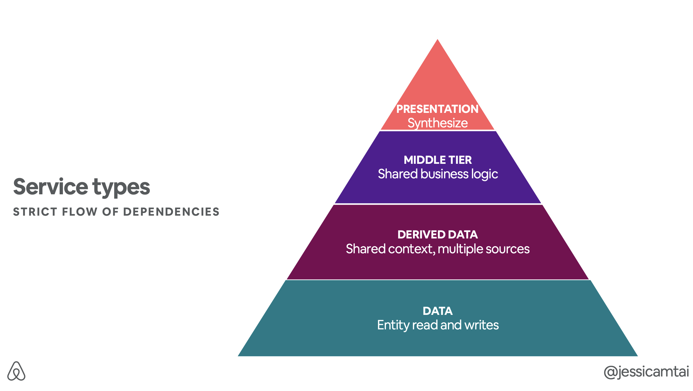
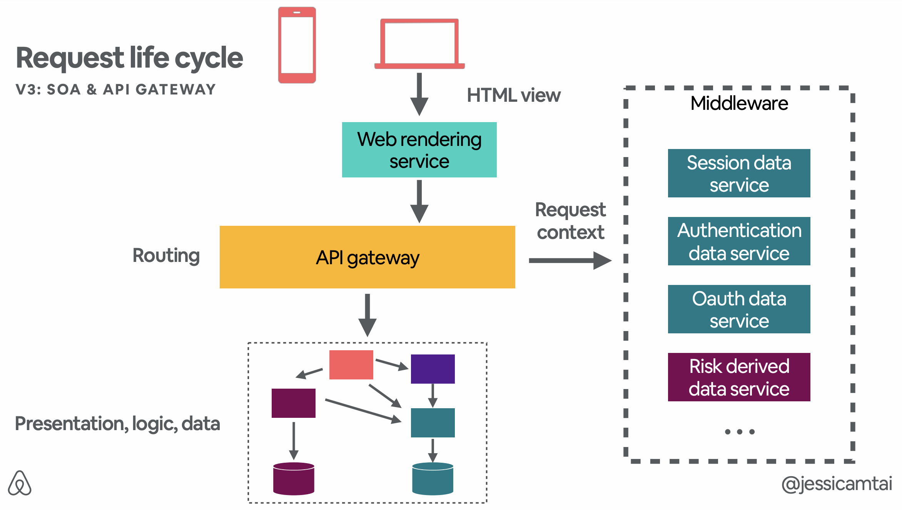
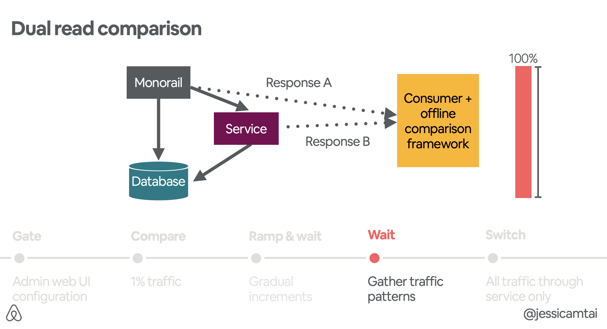
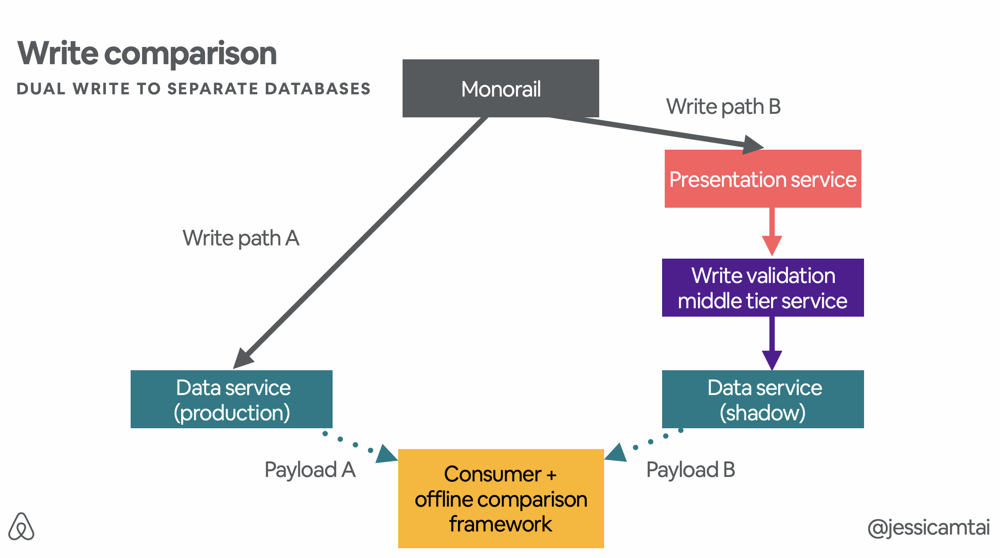
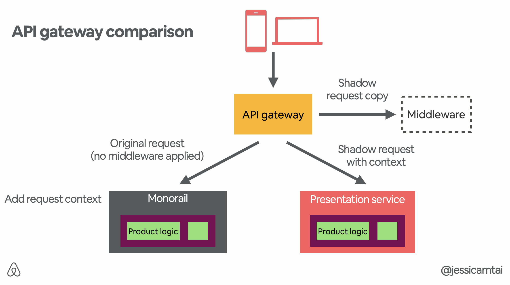

# Airbnb Migration Case Study
{: .no_toc }

Presented on 6/13/2021 by [Jihyun](https://github.com/jihyun-um)

## Table of contents
{: .no_toc .text-delta }

1. TOC
{:toc}

## Why Decide to Migrate?

### Problems Prior to Migration

New problems with rapidly growing engineering team

- Tightly coupled code
- Unclear ownership
- Increased production incidents
- Slow deployment chain

### Our Solution: Service-Oriented Architecture (SOA)

The solution we landed on was service-oriented architecture, or SOA. 

- A network of loosely coupled services.
- Clients makes their requests to an API gateway, and the gateway then routes their requests to multiple services and databases.
- Services are built, deployed, and scaled separately.
- Ownership is more clearly defined to be within the scope of the services supported API.

## Service Design Tenets

1. Services should own both the reads and the writes to their data.
    - A particular data storage should only have one service that's directly accessing it.
    - Good for this data consistency, as well as encapsulation and isolation.
2.  Services should address a specific concern.
    - Scope: Microservices < Services at Airbnb < Monolith
    - Services focused on specific business functionality.
3. Services should avoid duplicating functionality.
    - For shared parts of infrastructure or a code, use shared libraries and shared services.
4. Data mutation should propagate via standard events. 
    - We enable this by using [SpinalTap](https://github.com/airbnb/SpinalTap), which is a Change Data Capture service that was open sourced by Airbnb.
    - SpinalTap listens to various data sources, and when there are changes, it emits them via the standard event, in our case via Kafka. And then other services can then consume that event and act accordingly.

5. Building for production -  Each service should be built as if they were mission critical. 

- Appropriate alerting, observability, and best practices for infrastructure.

## Decompose by Request Life Cycle

### Version 1: Monorail

Everything goes through monorail. 

- Monorail is responsible for the presentation view, the business logic, and accessing the data.

### Version 2: Monorail & Services

Hybrid - monorail is now de-scoped to only being the routing and view layer.

- It sends API traffic to our network of services, where the services are then responsible for the business logic, modelling, and data accessing.
- There are four different service types.
    
    
    
    1. Data service does not have any other dependencies on other services, it only accesses data stores.
    2. Derived data service can read from data services as well as its own stores. It applies some basic business logic often used in a shared product context from various product use cases.
    3. Middle tier service contains more complex business logic that doesn't quite fit in the data service level or the derived data service level.
    4. Presentation service aggregates data from the data service and derived data services, and apply some business logic to return data to the frontend, which the user can then see in our product.

### Version 3: SOA & API Gateway

Monorail is eliminated completely.

- Mobile/Web client makes a request to the API gateway.
- API gateway is a service layer responsible for middleware and routing.
- API gateway will then populate request context from a series of middleware services, such as a session data store, or risk single store.
- It then routes the request to our SOA network where the services, again, are responsible for the presentation logic and data accessing.

## Compare for Differences

### Challenge

Two routes in hybrid model - monorail and services

- The requests can either go through monorail or through our services, but we wanted to make sure that the response have equal value.
- Used comparison frameworks to compare the responses from monorail and services.

### Read Comparison

- Compare read path A of monorail going directly to the database against some read path B flowing through our service, then compare the responses of these two paths.
- Emit them as standard events that can be consumed and sent to an offline comparison framework (for performance reasons and to avoid packing the online request cycle).
- Put this comparison framework and traffic behind an admin tool that is easily configurable via web UI → Important to be able to ramp up or completely shut off this comparison traffic with the click of a button, instead of requiring changes to code and then a code deployment.
- Start the ramp very slowly with a cautious 1% of traffic, looking at the comparison framework for differences. We continue to gradually ramp up the traffic, and while we're at 100%, we continue to wait to ensure that we gather enough traffic patterns to cover the different ways that this data can be accessed.
- Once the comparison looks clean, move over to serving all of our reads through this particular service.

### Write Comparison

- Writes are done a little bit differently because we cannot dual write to the same database, so instead we utilize a shadow database.
- Monorail, making a request to some production data service, is path A.
- And say we want to introduce a presentation service and a middle tier service. Let's call this path B, where it flows through the two new services, and the middle tier service will then write to a data service which is connected to a shadow database separate from production.
- Compare the requests sent to these two different data services and send these payloads, again, via standard events that can be consumed in an offline framework.
- With a similar ramp up process, we're able to ensure that we have a clean comparison and then cut over the traffic to writing purely through our new presentation and middle tier service.

### API Gateway Comparison

- Send the original request via some know-up through monorail and then monorail is responsible for adding the request context and handling the rest of the request.
- At the API gateway level, make a copy and the shadow request gets sent to be propagated to the middleware layer to get the request context.
- With this request context, the shadow requests can be sent throughout the SOA network, where, again, we compare the responses against the monorail path.
- Once the comparisons are clean, we were able to cut the know-up traffic to monorail and serve the API purely through our SOA network.

### Different Ways to Increment Migration

1. Migrating per endpoint
2. Migrating per attribute

## SOA Best Practices

### Challenge

Too much manual work for creating a service focused on business logic

- Writing client code in both Java and Ruby
- Server diagnostics, metrics, data validation, resilience features, error handling, etc.
- Runbooks, alerts, dashboard for monitoring

### Service Framework

- Aligned on using Thrift as our IDL (Interface Description Language).
- Engineers just need to wrap the service in a simple IDL layer, and the rest gets auto generated.
- Written configuration based way. Able to use additional annotation to express
    - "This is personal data"
    - "This endpoint accepts replay production traffic"
    - "This endpoint accepts rate limiting per client"
- Auto generated documentation that gets updated upon every deploy
- Fail fast mechanisms
- Automatically putting the dependencies in each service into separate asynchronous worker thread pools
- Graceful degradation

### Testing and Deploying

- When dev environment is completely different than production, it was difficult to be confident when merging a change and deploying it.
- Diffy (open source tool built by Twitter) compares the responses of staging against production.
    - We compare the results from responses of staging and primary, and we get these raw response differences.
    - We also pairwise compare the responses from primary and secondary; these two are running the exact same code, so any changes that we see here we determine to be non-deterministic noise.
    - Diffy tool allows us to filter out that noise, and we're left with the response differences that can be attributed to the new code that we just introduced on our staging tier.
- First deploy to a single instance of production called Canary and observe the graphs and dashboards. If this goes well, confidently deploy to the rest of production.
- Templated graphs generated by the IDL service show basic information about the service such as request rate, or air rate, or the clients calling it.

## Resources

- [QCon SF 2018 “Great Migration” presentation](https://www.infoq.com/presentations/airbnb-services-scalability/)
- [Building services at Airbnb](https://medium.com/airbnb-engineering/building-services-at-airbnb-part-1-c4c1d8fa811b)