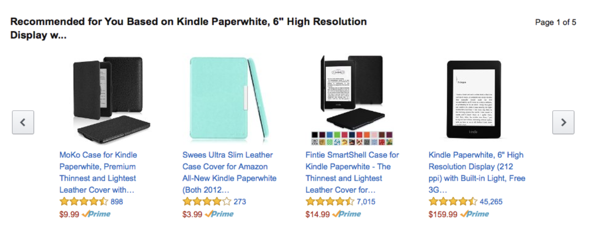

# Amazon Recommender System Case Study
{: .no_toc }
Presented on 31st October 2021 by [Jihyun](https://github.com/jihyun-um)

## Table of contents
{: .no_toc .text-delta }

1. TOC
{:toc}

# Recommender System

## What Is Recommender System?

Recommendation System **predicts a user’s preference** for a product and **serves personalized recommendations** based on the prediction.

### Relationships Among Users and Products

- **User-Product Relationship** - Does this user have a preference for this product?
- **Product-Product Relationship** - Is product A similar to product B?
- **User-User Relationship** - Is user A similar to user B?

### Relationships Provide Insight

- **User-Product Relationship** - What books will an user like?
- **Product-Product Relationship** - If an user buys a phone, what else will they buy?
- **User-User Relationship** - If Heath knows Taeim, and Taeim knows Jung, will Heath know Jung?

### Insight Is Monetizable

When a service recommends more personalized offers, users are more likely to make a purchase. This is how many businesses use the insignt for monetization. In fact, 35% of Amazon’s transactions come from recommendation algorithm.

- As the service acquires more users, they gain a larger dataset and therefore a better insight.
- The recommendations become more accurate.
- Users are satisfied with the recommendations, and this attracts more users.

## Type of Recommendations

### Content Based Filtering

Finding products with similar attributes

1. User purchases item A.
2. Find items that have similar attributes with item A.
3. Recommend these items to the user.

### Collaborative Filtering

Find products liked by users with similar interests

1. Jung purchases item A and B.
2. Taeim purchases item A, B and C.
3. Machine learning model learns that Jung and Taeim have common interests.
4. Jung might also like item C. Recommend item C to Jung.

### Association Rules Learning

Find complementary products

1. Many people who buy phones also buy phone cases.
2. Machine learning model learns the association rule between phones and phone cases.
3. Recommend phone cases to users who purchase phones.

# How Amazon Uses Recommender System

## Step 1: Data Processing

### Two Types of Data Processing

1. Batch Processing
    - Processes large volume of data all at once (periodically)
    - Use cases: Payroll, billing, orders from customers
    - Google Dataflow, Amazon Kinesis, Azure Stream Analytics
2. Stream Processing
    - Processes large volume of data all at once (periodically)
    - Use cases: Payroll, billing, orders from customers
    - Google Dataflow, Amazon Kinesis, Azure Stream Analytics

### Gathering Basic Data - Batch Processing

**Batch processing** is mainly used to gather basic data that don’t change often or don’t need to be updated in real time.

- User delivery address
- Item price, brand, color, size, weight, material, etc.
- Availability based on location
- Special deals

### Gathering Behavioral Data - Streaming

**Streaming** is mainly used to gather behavioral data that need to be updated in real time.

- Browsing history
- Purchase history

## Step 2: Data Transformation

Gathered data are transformed into appropriate format (e.g. JSON, CSV, etc.) and provided to the machine learning model.

## Step 3: Machine Learning Model Renewal

- Machine learning model is trained from the data provided in step 2.
- Model accuracy is evaluated based on user feedback (e.g. User purchased 2 itmes out of 10 recommendations).
- Item scoring is used to rank the recommendations. Scoring can depend on many factors, examples include:
    - Given an item is displayed to a user, how likely is the user to click the item?
    - Given a user clicked an item, how likely is the user to purchase the item?
    - Given a user purchased an item, how likely is the user to be satisfied with the item?

## The Big Picture

1. Data Pipeline regularly copies the full contents of a DynamoDB(NoSQL DB) table as JSON into an S3.
2. Exported JSON files are converted to CSV format to use as a data source for SageMaker(AI platform).
3. SageMaker renews the model artifact.
4. The converted CSV is available for ad hoc queries with Amazon Athena(data warehouse).
5. Data Pipeline repeats the cycle based on the schedule defined by customer requirements.

## Resources

- [AWS Big Data Blog](https://aws.amazon.com/blogs/big-data/analyze-data-in-amazon-dynamodb-using-amazon-sagemaker-for-real-time-prediction/)