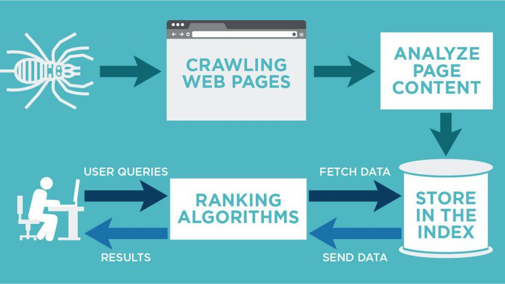
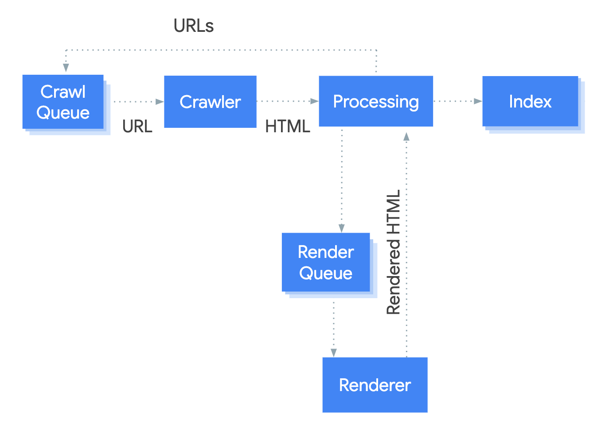

# How Google Search Works
{: .no_toc }
Presented on 7/25/2021 by [Jihyun](https://github.com/jihyun-um)

## Table of contents
{: .no_toc .text-delta }

1. TOC
{:toc}

## Crawling

- Google uses a web crawler (also known as spider) called [Googlebot](https://developers.google.com/search/docs/advanced/crawling/googlebot) to visit new and updated pages to be added to Google index.
- Googlebot uses an algorithmic process to determine which sites to crawl, how often, and how many pages to fetch from each site.
- Google's crawl process begins with a list of web page URLs, generated from previous crawl processes, augmented by [Sitemap](https://developers.google.com/search/docs/advanced/sitemaps/build-sitemap) data provided by website owners.
- When Googlebot visits a page it finds links on the page and adds them to its list of pages to crawl. New sites, changes to existing sites, and dead links are noted and used to update the Google index.
- During the crawl, Google renders the page using a recent version of Chrome. As part of the rendering process, it runs any page scripts it finds. If your site uses dynamically-generated content, be sure that you [follow the JavaScript SEO basics](https://developers.google.com/search/docs/advanced/javascript/javascript-seo-basics).

### How does Google know which pages not to crawl?
- Pages blocked in [robots.txt](https://developers.google.com/search/docs/advanced/robots/create-robots-txt) won't be crawled, but still might be indexed if linked to by another page. Google can infer the content of the page by a link pointing to it, and index the page without parsing its contents.
- Google can't crawl any pages not accessible by an anonymous user. Thus, any login or other authorization protection will prevent a page from being crawled.
- Pages that have already been crawled and are considered [duplicates](https://developers.google.com/search/docs/advanced/crawling/consolidate-duplicate-urls) of another page, are crawled less frequently.

### Improve your crawling
Use these techniques to help Google discover the right pages on your site:

- Submit a sitemap.
- Submit [crawl requests](https://developers.google.com/search/docs/advanced/crawling/ask-google-to-recrawl) for individual pages.
- Use a [simple, human-readable, and logical URL paths for your pages](https://developers.google.com/search/docs/advanced/guidelines/url-structure) and provide clear and direct internal links within the site.
- If you use URL parameters on your site for navigation, for instance if you indicate the user's country in a global shopping site, [use the URL parameters tool to tell Google about important parameters](https://support.google.com/webmasters/answer/6080550).
- Use robots.txt wisely: Use robots.txt to indicate to Google which pages you'd prefer Google to know about or crawl first, in order to protect your server load, not as a method to block material from appearing in the Google index.
- Use [hreflang](https://developers.google.com/search/docs/advanced/crawling/localized-versions) to point to alternate versions of your page in other languages.
- Clearly identify your [canonical page and alternate pages](https://developers.google.com/search/docs/advanced/crawling/consolidate-duplicate-urls).
- View your crawl and index coverage using the [Index Coverage Report](https://support.google.com/webmasters/answer/7440203).
- Be sure that Google can access the key pages, and also the important resources (images, CSS files, scripts) needed to render the page properly.
- Confirm that Google can access and render your page properly by running the [URL Inspection tool](https://support.google.com/webmasters/answer/9012289) on the live page.

## Indexing

- Googlebot processes each page it crawls in order to understand the content of the page. This includes processing:
    - textual content,
    - key content tags and attributes, such as `<title>` tags and alt attributes,
    - images, videos, and more.
    - Exception: Googlebot cannot process the content of some rich media files.
- Somewhere between crawling and indexing, Google determines if a page is a [duplicate or canonical](https://developers.google.com/search/docs/advanced/crawling/consolidate-duplicate-urls) of another page. If the page is considered a duplicate, it will be crawled much less frequently.
- Similar pages are grouped together into a *document,* which is a group of one or more pages that includes the canonical page (the most representative of the group) and any duplicates found (which might simply be alternate URLs to reach the same page, or might be alternate mobile or desktop versions of the same page).
- Note that Google doesn't index pages with a [`noindex` directive](https://developers.google.com/search/docs/advanced/crawling/block-indexing) (header or tag). However, it must be able to see the directive; if the page is blocked by a [robots.txt file](https://developers.google.com/search/docs/advanced/robots/intro), a login page, or other device, it is possible that the page might be indexed even if Google didn't visit it!

### What is a "document"?
- Internally, Google represents the web as an enormous set of *documents*. Each document represents one or more web pages. These pages are either identical or very similar, but are essentially the same content, reachable by different URLs.
- Google chooses one of the URLs in a document and defines it as the document's *[canonical](https://developers.google.com/search/docs/advanced/crawling/consolidate-duplicate-urls) URL*. The document's canonical URL is the one that Google crawls and indexes most often; the other URLs are considered *duplicates* or *alternates*, and may [occasionally be crawled](https://developers.google.com/search/docs/advanced/crawling/googlebot), or served according to the user request
- You can [tell Google which URL you prefer to be canonical](https://developers.google.com/search/docs/advanced/crawling/consolidate-duplicate-urls), but Google may choose a different canonical for various reasons.

### Improve your indexing
There are many techniques to improve Google's ability to understand the content of your page:

- Prevent Google from crawling or finding pages that you want to hide using the [`noindex` tag](https://developers.google.com/search/docs/advanced/crawling/block-indexing). Don't "noindex" a page that is blocked by robots.txt; if you do so, the `noindex` tag won't be seen and the page might still be indexed.
- [Use structured data](https://developers.google.com/search/docs/advanced/structured-data/intro-structured-data).
- Follow the [Google Webmaster Guidelines](https://developers.google.com/search/docs/advanced/guidelines/webmaster-guidelines).
- Read our [SEO starter guide](https://developers.google.com/search/docs/beginner/seo-starter-guide) and [advanced user guide](https://developers.google.com/search/docs/advanced/guidelines/get-started) for more tips.

## Serving results
When a user enters a query, our machines search the index for matching pages and return the results we believe are the most relevant to the user. Relevancy is determined by hundreds of factors, and we always work on improving our algorithm. 

### Meaning of your query
To return relevant results for your query, we first need to establish what information you’re looking for – the intent behind your query. Understanding intent is fundamentally about understanding language, and is a critical aspect of Search. We build language models to try to decipher what strings of words we should look up in the index.

- Interpreting spelling mistakes
- Identifying synonyms (this improves results in over 30% of searches)
- Categorising information user is looking for
- Using freshness algorithms to interpret whether user is searching for fresh content

### Relevance of webpages
Next, algorithms analyse the content of webpages to assess whether the page contains information that might be relevant to what you are looking for.

- Keyword matching
- Machine learning to estimate relevance

### Ranking useful pages
For a typical query, there are thousands, even millions, of web pages with potentially relevant information. So to help rank the best pages first, we also write algorithms to evaluate how useful these web pages are.

- Serving sites that many users value for similar queries
- Removing spam and sites that violate [Google’s webmaster guidelines](https://support.google.com/webmasters/answer/35769?hl=en-GB)
- Continuously measuring and assessing the quality of the systems

### Usability of webpages
When ranking results, Google Search also evaluates whether webpages are easy to use. When we identify persistent user pain points, we develop algorithms to promote more usable pages over less usable ones, all other things being equal.

- Whether the site appear correctly in different browsers
- Whether it is designed for all device types and sizes
- Whether the page loading times work well for users with slow internet connections

### Context and settings
Information such as your location, past Search history and Search settings all help us to tailor your results to what is most useful and relevant for you in that moment.

- Country and location to deliver content relevant for user's area
- Search settings and SafeSearch settings
- Recent search activity
- Recent Google account activity

### Improve your serving
There are many ways to improve how Google serves the content of your page:

- If your results are aimed at users in specific locations or languages, you can [tell Google your preferences](https://developers.google.com/search/docs/advanced/crawling/managing-multi-regional-sites).
- Be sure that your page [loads fast](https://developers.google.com/speed) and is [mobile-friendly](https://developers.google.com/search/mobile-sites).
- Follow the [Webmaster Guidelines](https://developers.google.com/search/docs/advanced/guidelines/webmaster-guidelines) to avoid common pitfalls and improve your site's ranking.
- Consider [implementing Search result features](https://developers.google.com/search/docs/advanced/structured-data/search-gallery) for your site, such as recipe cards or article cards.
- [Implement AMP](https://developers.google.com/search/docs/advanced/experience/about-amp) for faster loading pages on mobile devices. Some AMP pages are also eligible for additional search features, such as the top stories carousel.
- Google's algorithm is constantly being improved; rather than trying to guess the algorithm and design your page for that, work on creating good, fresh content that users want, and following our guidelines.

**Resources:**
- https://developers.google.com/search/docs/advanced/guidelines/how-search-works
- https://www.google.com/search/howsearchworks/algorithms