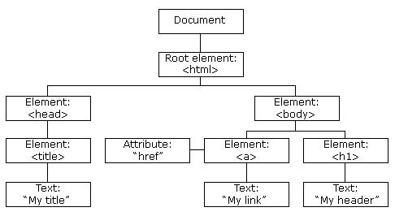

# DOM manipulation
{: .no_toc }

Presented on 28th Feb 2021 by [Jung](https://github.com/junglee1101)

## Table of contents
{: .no_toc .text-delta }

1. TOC
{:toc}

## Web browser 

----
(src: [MDN](https://developer.mozilla.org/en-US/docs/Learn/JavaScript/Client-side_web_APIs/Manipulating_documents))

Web APIs give us access to many functionality that enable us to perform DOM manipulation with web pages. 

- The window is the browser tab that a web page is loaded into - this can be access in JavaScript by the `Window` object. Using this method, you can return the window's size (`window.innerWidth` and `window.innerHeight`), manipulate the document that loaded into the web page, store data on the client-side (e.g. local database) and attach an event handler to the current window. 

- The navigator is the state and identify of the browser (e.g. user-agent). In JavaScript, you can access is by the `Navigator` object. you can use this to detect user's preferred language, devices and browser version etc. 

- The document is the actual page that are loaded into the window, which are represted as `Document` object. You use this object to manipulate DOM by referencing an element in the DOM, change its text content, apply styles to the element, create and remove element in the DOM. 

## DOM - The Document Object Model

----


(src: [freeCodeCamp](https://www.freecodecamp.org/news/how-to-manipulate-the-dom-beginners-guide/))

The Document Object Model(DOM) is a programming interface for web documents. The "tree structure" enables the HTML structures to be accessible - the developer can manipulate the DOM with JavaScript after the page has been rendered. 

Each entry in the tree is called a `node`. 

```
<!DOCTYPE html>
<html lang="en">
<head>
</head>
<body>
    <div>
        
        <input />
    </div>
</body>
</html>
```
- `Root node`: The top node in the tree which is always `HTML` node. 

- `Child node`: A node directly inside of node, `IMG` is a child of `DIV`. 

- `Descendant node`:A node anywhere inside another node. For example `IMG` is a descendant of `BODY`.

- `Parent node`: A node that wrap the node. `BODY` is a parent node of `DIV`.

- `Sibling node`: Node that sit on the same level in the DOM tree. `IMG` and `INPUT` are siblings in the above example. 

## DOM manipulation

----
In order to manipulate any dom in a dom tree, you first need to store a reference of a dom inside a variable. 

```
const newDiv = document.querySelector('div')
```

now we have the element refernce, we can manipulate it using properties and methods that are available (This can be found [here](https://developer.mozilla.org/en-US/docs/Web/API/Node)).

`Document.querySelector()` is the recommended modern way of selecting elements using CSS selectors. `querySelector()` returns the first `Element` within the document that matches the specified selector. If no matches are found, `null` is returned. CSS Selectors select HTML elements based on *id*, *classes*, *types*, *attributes*, *values of attributes* etc. If you want to match multiple elements, you can use `Document.querySelectorAll()` which matches every element that matches the selector. This will store references in an array-like object called a `NodeList`. 

`Document.getElementById()` and `Document.getElementsbyTagName()` are older moethods for selecting elements but these works better in older browsers. 

## Creating and placing new nodes 

----

```
const newDiv = document.querySelector('div')
const firstPara = document.createElement('p')
firstPara.textContent = 'London Koders are great' 
newDiv.appendChild(firstPara)
```
`div` element is selected and assigned to newDiv variable. A new element `<p>` is created and assigned to a variable valled `firstPara`. Then text content 'London koders are great' is added inside of `<p>` node. Then this is appended to a parent node `newDiv` as a child node. 

## Moving and removing elements 

----
Removing node from the DOM can be done by using `removeChild()` which removes from its parent. 

From the above example, we can remove `firstPara` reference from newDiv variable by `newDiv.removeChild(firstPara)`. 

If you want to remove a node based only on a reference to itself, you can use `Element.remove()` which are supported in modern browsers. 

## Manipulate Styles 

----

There are several ways of manipulate CSS styles via JavaScript. The first way is to add inline styles directly onto elements by `Element.style` property. However, inline style is not best practice as adding CSS rules to every HTML element is time consiuming and can affect your page's size and download time. 

The second way of manipulating style in element is by setting css attribute directly to the element. `Element.setAttribute()` takes two arguments, the attribute you want to add on the element, and the value you want to set it to. For example, if you want to add a class attribute to the element, it will be added like this `Element.setAttribute('class', 'class-name')`. Then this class can be used in stylesheet to add your style. 


## Resources 
1. [MDN docs](https://developer.mozilla.org/en-US/docs/Learn/JavaScript/Client-side_web_APIs/Manipulating_documents)

2. [FreeCodeCamp](https://www.freecodecamp.org/news/how-to-manipulate-the-dom-beginners-guide/)