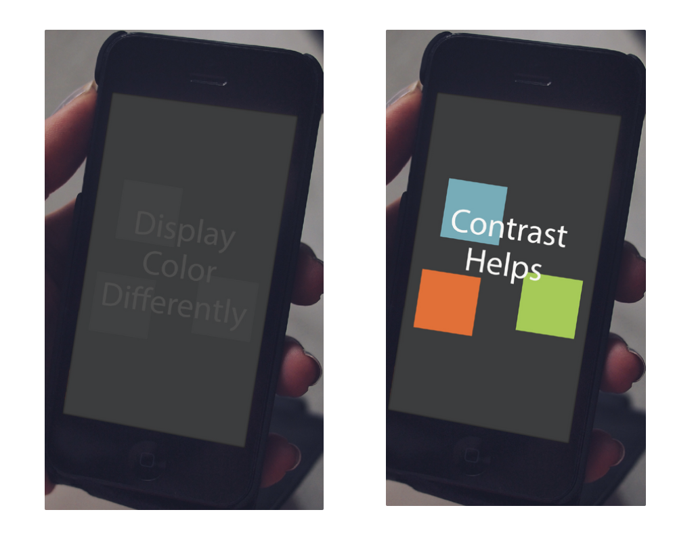
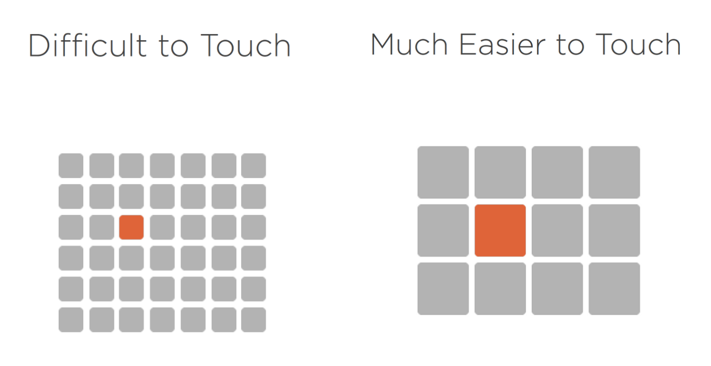
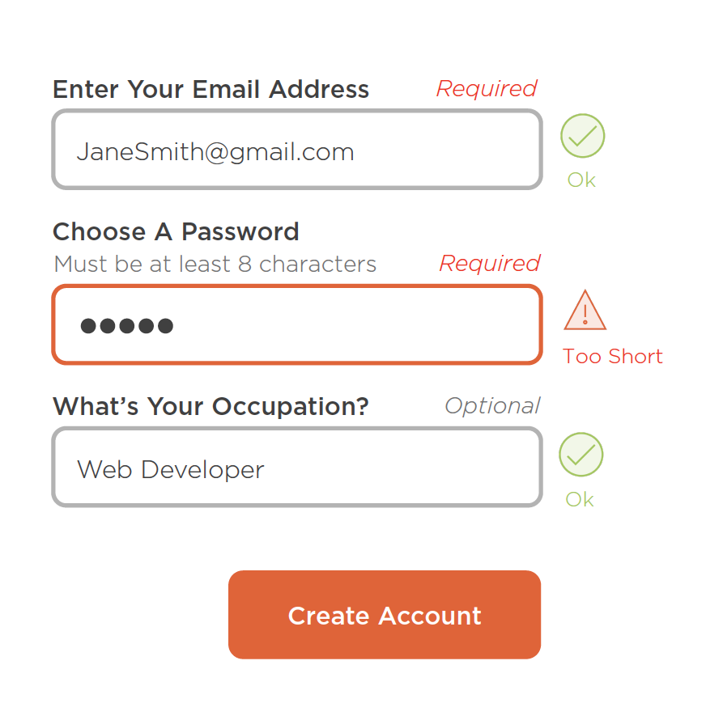

# Web Accessibility
{: .no_toc }
Presented on 23rd March 2021 by [Jihyun](https://github.com/jihyun-um)

## Table of contents
{: .no_toc .text-delta }

1. TOC
{:toc}

## What Is Web Accessibility?

- Web accessibility is the inclusive practice of ensuring there are no barriers that prevent interaction with, or access to, websites by people with physical disabilities, situational disabilities, and socio-economic restrictions on bandwidth and speed.
- Accessible websites can reach the widest range of people possible, including those with disabilities, and everyone else as well.
- In order to make websites accessible, we need to understand various situations:
    - Blind or color blindness
    - Screen readers
    - Keyboard behavior
    - Cognitive issues
    - Temporary issues
    - Changing abilities
    - Urgent situations

### Why Is Web Accessibility Important?

- Not everyone uses the web the same way.
- It’s good for business.
- It’s the law.
- Technology is for everyone.

## Understanding the WCAG

### WCAG Overview

- Web Content Accessibility Guidelines(WCAG) is a single set of accessibility guidelines that contain “success criteria” and “levels of conformance” to ensure the content is accessible to as many people as possible.
- WCAG 1.0 was the first international standard, published in May 1999. It had 14 guidelines.
- WCAG 2.0 was published in December 2008. It had 12 guidelines with the emphasis on P.O.U.R principles.
    - P: Perceivable
    - O: Operable
    - U: Understandable
    - R: Robust
- WCAG 2.1 was published in June 2018, and is the official W3C recommendation as of today.

### Understanding WCAG 2.1

**Perceivable: Guidelines 1.1–1.5**

- 1.1: Provide text alternatives for non-text content
- 1.2: Provide alternative methods for time-based media
- 1.3: Provide ability to present content in different ways, allow for customization
- 1.4: Make it easier to see and hear content

**Operable: Guidelines 2.1–2.4**

- 2.1: Make functionality available via the keyboard
- 2.2: Provide enough time to interact
- 2.3: Avoid designing/developing content that causes seizures
- 2.4: Help navigate, find content, and determine where they are focused
- 2.5: Accessibility for inputs beyond the keyboard, gestures, motion, labelling, touch targets, concurrent input mechanisms, etc.

**Understandable: Guidelines 3.1–3.3**

- 3.1: Text content should be understandable
- 3.2: Interface should be consistent and predictable
- 3.3: Help users fix mistakes

**Robust: Guideline 4.1**

- 4.1: Maximize compatibility of user agents and assistive technologies

### Levels of Conformance

- A: Lowest level
- AA: Mid-range level
- AAA: Highest level

## Designing with Accessibility in Mind

### Color

Contrast helps, but make sure not to use color as the only way to convey information for color blind people.

### Touch Targets

- Recommended size: 44px-48px width and height
- The bigger the touch target is, the easier it is to touch it.
- Make sure there is enough spacing between different touch targets to minimize the chance of making mistakes.

### Typography

- Use relative units (ems, rems, %) rather than fixed units (pixels).
- Give enough contrast for different types of texts - headings, subheadings, body.
- Don’t use too long or too short line length. 45-75 characters per line are recommended.
- Don’t use too big or too small line height.
- Left aligned texts are more readable.
- Texts in all caps are harder to read for people and for screen readers as well.

## Developing with Accessibility in Mind

### Navigation and Content

- Headings provide the document outline and provide navigation targets for assistive technologies. Need to be used in a meaningful order.
- Use unordered list when no order of sequence or importance is needed.
- Use ordered list when order of sequence or importance *is* needed.
- Use description list when a description for each item is needed, or for key, value pairs.
- Keep the keyboard control in mind.
- Use correct tab order.
- Allow users to skip large chunks of navigation by adding “Skip to content link”.

### Forms

- Identify required fields.
- Add special formatting requirements.
- Add clear, descriptive labels.
- Provide clear feedback for errors and warnings.

### Images

- Add short descriptions of the content of the image using `alt` attribute, e.g. ``
    - Present the content and function of the image.
    - Should be succinct, a single sentence or two.
- For images containing content, it’s better to just use text the text equivalent.
- For purely decorative images that don’t need descriptions, use `aria-hidden=“true”` so that they are hidden from assistive technologies.

### Videos and Audios

- Add captions as text alternatives for videos or audios.
    - Help those that are hearing impaired or do not have access to sound.
    - Closed and open captions are acceptable.
- Captions should be synchronized with audio and adjustable for size, font, and color.
- Providing transcripts helps.
    - Allow content to be read in one form or another.
    - Provide a textual version of the content.
    - Not intended to be created verbatim.

## Resources

- [Wikipedia: Web accessibility](https://en.wikipedia.org/wiki/Web_accessibility)
- [PluralSight Course: Developing Websites for Accessibility](https://app.pluralsight.com/library/courses/developing-websites-accessibility-getting-started/table-of-contents)
- [WCAG 2.1 official website](https://www.w3.org/TR/WCAG21/)