# Chat System Architecture
{: .no_toc }
Presented on 2nd June 2022 by [Jihyun](https://github.com/jihyun-um)

## Table of contents
{: .no_toc .text-delta }

1. TOC
{:toc}

## Main functions

### Overall

- A one-on-one chat with low delivery latency
- Small group chat
- Online presence
- Multiple device support
- Push notifications

### Chat Service

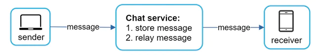

- Receive messages from other clients.
- Find the right recipients for each message and relay the massage to the recipients.
- If the recipient is not online, hold the message for that recipient on the server until she is online.

## Techniques for Server-initiated Connection

### Polling

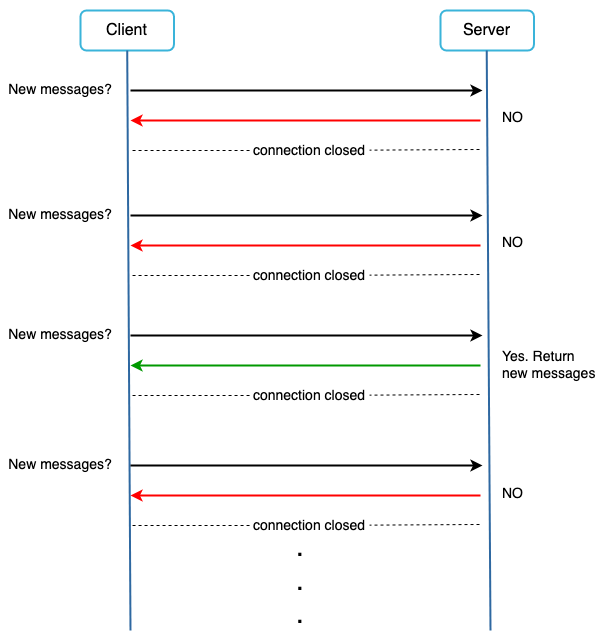

- Client periodically asks the server if there are messages available.

**Drawbacks**

- Depending on polling frequency, polling could be costly. It could consume precious server resources to answer a question that offers no as an answer most of the time.

### Long Polling

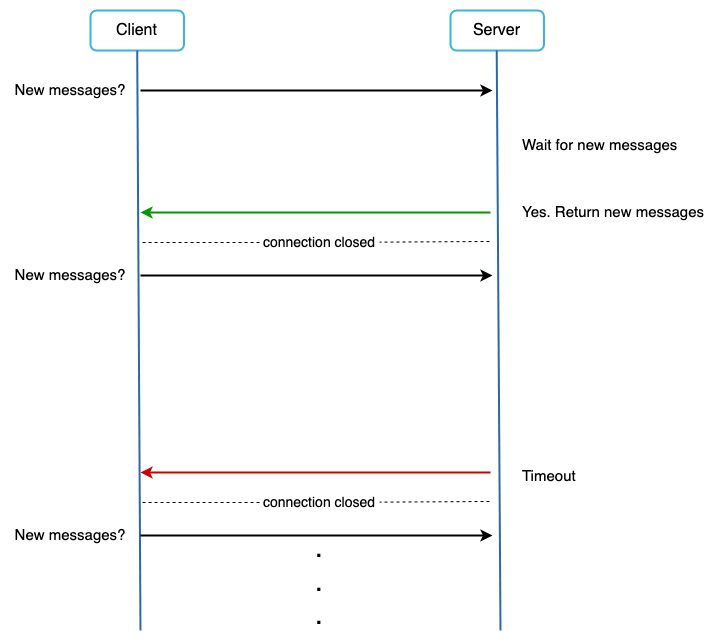

- Client holds the connection open until there are actually new messages available or a timeout threshold has been reached.
- Once the client receives new messages, it immediately sends another request to the server, restarting the process.

**Drawbacks**

- Sender and receiver may not connect to the same server. If you use round robin for load balancing, the server that receives the message might not have a long-polling connection with the client that receives the message.
- Server has no good way to tell if the client is disconnected.
- It is inefficient. Even if a user doesn’t chat much, long polling still makes periodic connections after timeouts.

### WebSocket

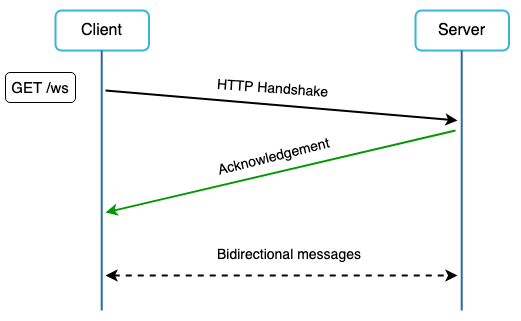

- WebSocket connection is initiated by the client. It is bi-directional and persistent.
- It starts its life as a HTTP connection and could be “upgraded” via some well-defined handsake to a WebSocket connection.
- Through this persistent connection, server can send updates to client.
- WebSocket is the most common solution for sending asynchronous updates from server to client.

## High-level Design

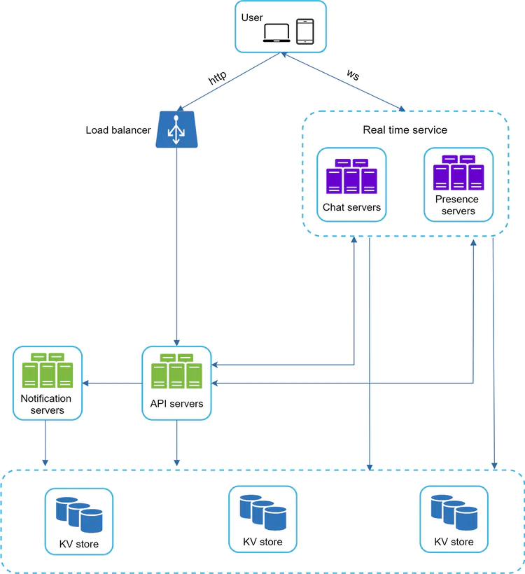

### Services

- Chat servers facilitate message sending/receiving.
- Presence servers manage online/offline status.
- API servers handle everything including user login, signup, etc.
- Notification servers send push notifications.

### Storage

- Generic data, such as user profile, setting, user friends list, are stored in relational databases.
- Chat history data are stored in key-value stores.

**Read/Write pattern for chat history data**

- The amount of data is enormous for chat systems. A previous study reveals that Facebook messenger and Whatsapp process 60 billion messages a day.
- Only recent chats are accessed frequently. Users don’t usually look up for old chats.
- Users might use features that require random access of data, such as search, view your mentions, jump to specific message, etc. These cases should be supported by the data access layer.
- The read to write ratio is about 1:1 for 1 on 1 chats.

**Reasons for choosing key-value stores**

- Key-value stores allow easy horizontal scaling.
- Key-value stores provide very low latency to access data.
- Relational databases do not handle [long tail](https://en.wikipedia.org/wiki/Long_tail) of data well. When the indexes grow large, random access is expensive.
- Key-value stores are adopted by other proven reliable chat applications. Both Facebook messenger and Discord use key-value stores. Facebook messenger uses HBase, and Discord uses Cassandra.

## Design Deep Dive

### Service Discovery

- Service discovery recommends the best chat server for a client based on the criteria like geographical location, server capacity, etc.
- Apache Zookeeper is a popular open-source solution for service discovery. It registers all the possible chat servers and picks the best chat server for a client based on predefined criteria.

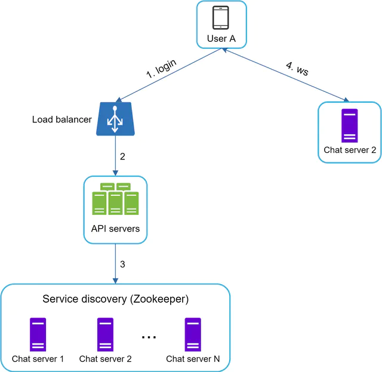

1. User A tries to log in to the app.
2. The load balancer sends the login request to API servers.
3. After the backend authenticates the user, service discovery finds the best chat server for User A. In this example, Chat server 2 is chosen and the server info is returned back to User A.
4. User A connects to Chat server 2 through WebSocket.

### Message Flow

**1 on 1 chat flow**

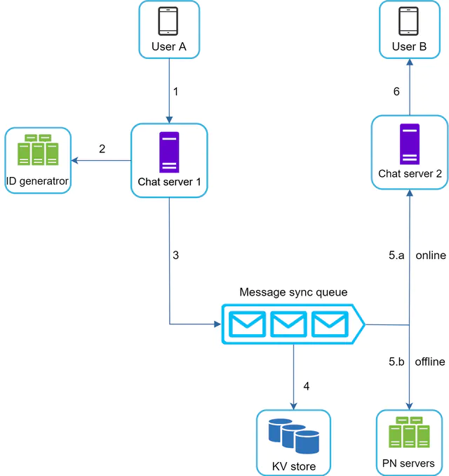

1. User A sends a chat message to Chat server 1.
2. Chat server 1 obtains a message ID from the ID generator.
3. Chat server 1 sends the message to the message sync queue.
4. The message is stored in the key-value store.
5. Two scenarios based on User B’s online presence:
    1. If User B is online, the message is forwarded to Chat server 2 where User B is connected.
    2. If User B is offline, a push notification is sent from the PN servers.
6. Chat server 2 forwards the message to User B through a persistent WebSocket connection between User B and Chat server 2. 

****Small group chat flow****

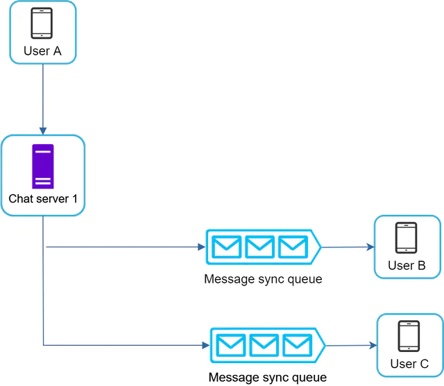

1. User A sends a message in a group chat.
2. The message from User A is copied to each group member’s message sync queue: one for User B and the second for User C.
3. The rest steps are similar to 1 on 1 chat flow.

You can think of the message sync queue as an inbox for a recipient. It simplifies message sync flow as each client only needs to check its own inbox to get new messages. When the group number is small, storing copy in each recipient’s inbox is not too expensive. However, for groups with a lot of users, storing a message copy for each member is not acceptable.

****Message synchronization across multiple devices****

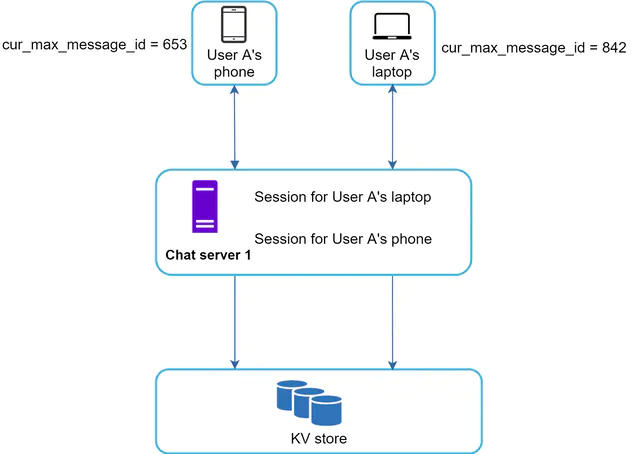

1. When User A logs in to the chat app with her phone, it establishes a WebSocket connection with Chat server 1. Similarly, there is a connection between the laptop and Chat server 1.
2. Each device maintains a variable called `cur_max_message_id`, which keeps track of the latest message ID on the device. Messages that satisfy the following two conditions are considered as new messages:
    1. The recipient ID is equal to currently logged-in user ID.
    2. Message ID in the key-value store is larger than `cur_max_message_id`.
3. With distinct `cur_max_message_id` on each device, message synchronization is easy as each device can get new messages from the KV store.

### Online Presence

An online presence indicator is an essential feature of many chat applications. Usually, you can see a green dot next to a user’s profile picture or username. Presence servers are responsible for managing online status and communicating with clients through WebSocket.

**User login**

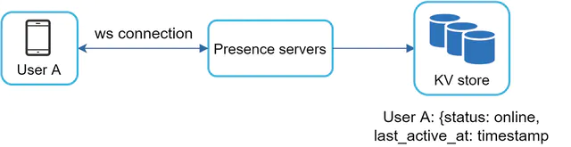

After a WebSocket connection is built between the client and the real-time service as described in the “Service Discovery” section, User A’s online status and `last_active_at` timestamp are saved in the KV store. The presence indicator shows the user is online.

**User logout**

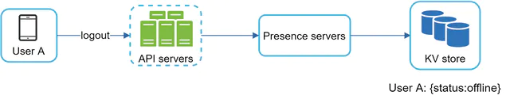

When a user logs out, the online status is changed to offline in the KV store. The presence indicator shows the user is offline.

**User disconnection**

When a user disconnects from the internet, the persistent connection between the client and the server is lost. A naive way to handle user disconnection is to mark the user as offline and change the status to online when the connection re-establishes. However, updating online status on every disconnect/reconnect would make the presence indicator change too often, resulting in poor user experience.

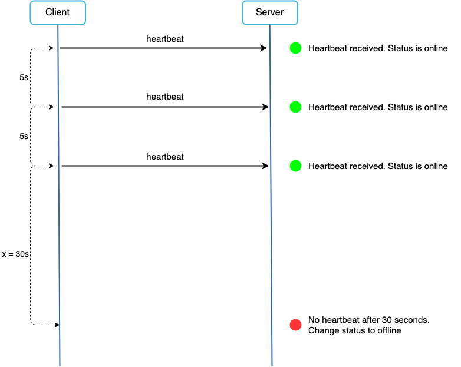

Heartbeat mechanism can be used to solve this problem.

- An online client sends heartbeat event to presence servers periodically.
- If presence servers receive a heartbeat event within a certain time, the user is considered as online. Otherwise, it is offline.

**Online status fanout**

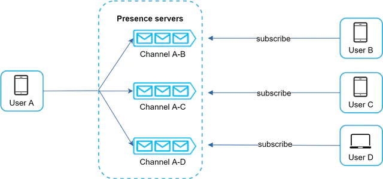

How do User A’s friends know about the status changes?

- Presence servers use a publish-subscribe model, in which each friend pair maintains a channel.
- When User A’s online status changes, it publishes the even to three channels, channel A-B, A-C, A-D, which are subscribed by User B, C, and D respectively.
- The communication between clients and servers is through real-time WebSocket.

The above design is effective for a small group. For larger groups, informing all members about online status is expensive and time consuming. To solve the performance bottleneck, a possible solution is to fetch online status only when a user enters a group or manually refreshes the friend list.

## Additional Topics

- Supporting media files such as photos and videos - Media files are significantly larger than text in size. Compression, cloud storage, and thumbnails are interesting topics to talk about.
- End-to-end encryption. [Whatsapp supports end-to-end encryption](https://faq.whatsapp.com/general/security-and-privacy/end-to-end-encryption) for messages. Only the sender and the recipient can read messages.
- Caching messages on the client-side is effective to reduce the data transfer between the client and server.
- Improve load time. [Slack built a geographically distributed network](https://slack.engineering/flannel-an-application-level-edge-cache-to-make-slack-scale/) to cache users’ data, channels, etc. for better load time.
- Message resend mechanism. Retry and queueing are most common techniques for resending messages.

## Resources

- [[ByteByteGo] Design A Chat System](https://bytebytego.com/courses/system-design-interview/design-a-chat-system)