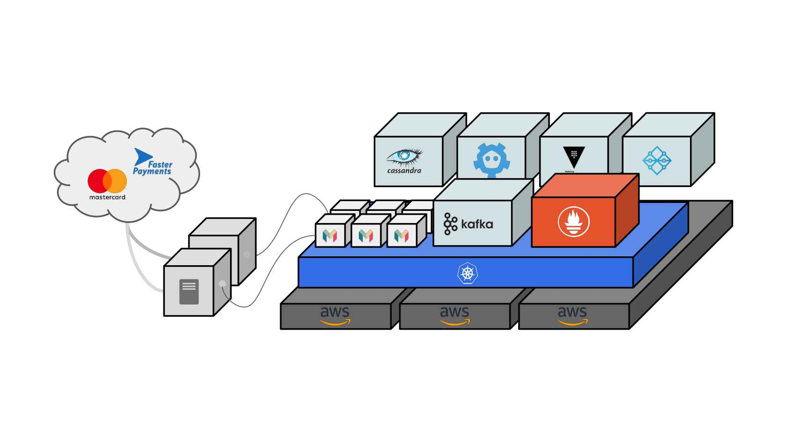

At the early stage of Monzo, the engineering team of Monzo focused on building a robust banking platform that is extensible, scalable, resillient and secure. They wanted to avoid the traditional approach of building something that meets the initial level of load for a product and later going through a massive re-platforming process to handle the now grown and bigger user base later in the product lifecycle.

# Tech choices

## Programming language: Go
- Simple
- Statically typed
- Backward compatibility guarantee
- Performant and builds fast

## Distributed technologies
Monzo wanted to avoid the main / secondary back-up approach with failover strategy, as they did not want to rely on a lever that needed to be pulled when something happens. If the 'lever' is not pulled often, it's hard to test and guarantee that this failover will work reliably.

### Cassandra for database
- Distributed datastore with no master node
- Handles scale well, as well as providing tunable consistency

### Kubernetes
- Migrated from Mesos in the late 2016, after it became evident that K8s was going to be the market leader in the Container Orchestration platform realm
- Migration allowed saving lots of money in the long run, by shutting down loads of infrastructure

### Kafka
- Distributed Event Streaming platform
- Great choice for services like Monzo that needs to provide certain guarantee for some operations, as Kafka provides good support for message resilliency, as well as message ordering where strict sequence of operations can be useful in some scenarios

# Diverse Product Features
Monzo provides diverse product features, powered by its scalable and extensible technology platform. They implemented many features in house, such as cade issuing, card processing and also many peripheral bespoke solutions such as chat system for customer support, and bespoke solution for the internal teams to use to talk to people and manage variety of tasks.
These diverse features are implemented as composition of many microservices that are each managing their narrow domain of responsibilities.

As of 2020 when they held an [InfoQ presentation](https://www.infoq.com/presentations/monzo-microservices/), Monzo was operating over 1600 microservices on their tech platform.

# What's in the Microservice?

Monzo's microservices utilis many shared core libraries that handle cross-cutting concerns such as RPC, Database calls, locking (via etcd), logging etc. By relying on a well-defined, well-tested and well-supported set of libraries and toolings, engineers can focus on the business problem at hand without rewriting core abstractions like marshalling of data, monitoring or making remote calls. Building a new microservice is essentially becomes adding the business logic code inside a well-defined box.

These shared library layer also allows every service to benefit when there are improvements made or bugs fixed for these shared libraries, having global and cascading improvements across the entire platform.

# The Benefits of Standardisation

## Organisational flexibility
Since even trivial things such as file structure of the project for a microservice are standardised, there's no friction for an Engineer when they move to a different team. No matter what team they are in, they will know where to find things in their service.

## Unified Toolings
Standardisation of the microservices meant they can build toolings that can be used to operate on all of their services. These can range from deployment tools, parsers to extract out information about the code, or service query to print out all the API endpoints for a given service.

## Metrics and Alerts
Every single service using the shared core libraries get a wealth of metrics built for free. With the provided fully templated dashboard, engineers can gain visualisations of the metrics for their new service without additional configurations.

## Unified RPC Layer and Tracing
Service to service communication is enriched with Tracing and unified logging, by tracing IDs and context paramters that are parsed across service boundaries.

# Additional Notes
- Monzo uses etcd as a lock store for operations that require some transactional handling across multiple services
- Services can also communicate to each other in asynchronous manner via event sourcing using Kafka. This is useful for operations that are either not requiring of immediate response (e.g. synchronising the state of the card to Apple Pay or Google Pay after the card has been frozen by the customer), or things that are 'nice to have' but don't make sense to be on the critical path to fail the entire operations (e.g. Sending a push notification for a transaction)

# Reference materials

- [InfoQ - Modern Banking in 1500 Microservices](https://www.infoq.com/presentations/monzo-microservices/)
- [Software Engineering Daily Podcast - The State of Digital Banking](https://softwareengineeringdaily.com/2018/10/09/the-state-of-digital-banking/)
