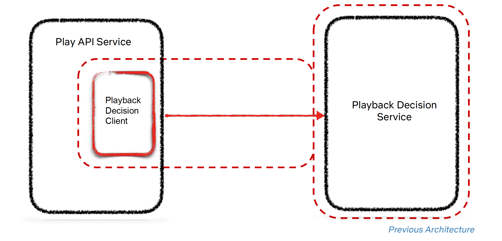
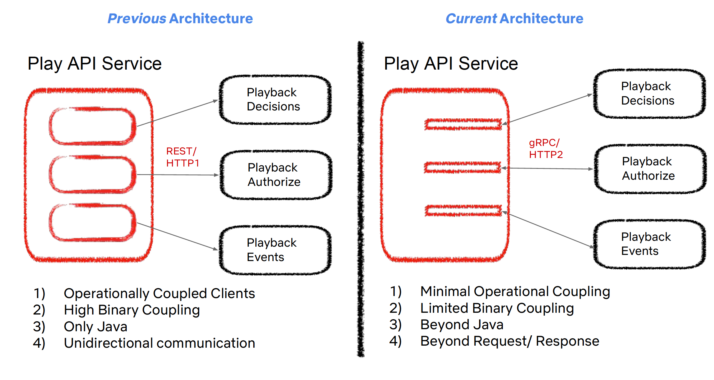
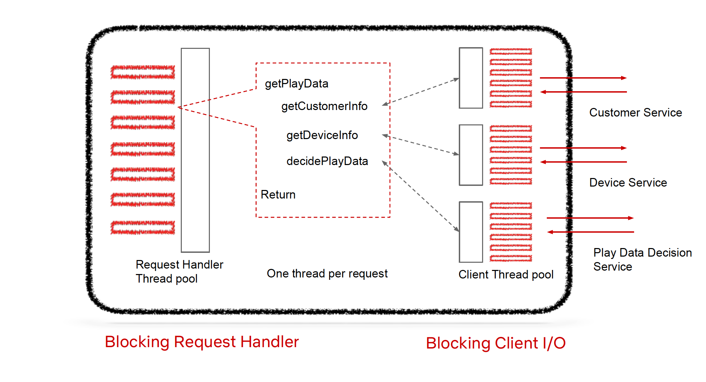
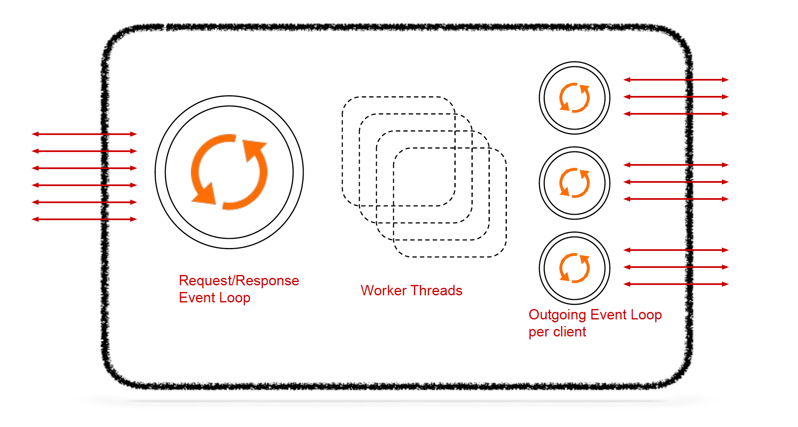
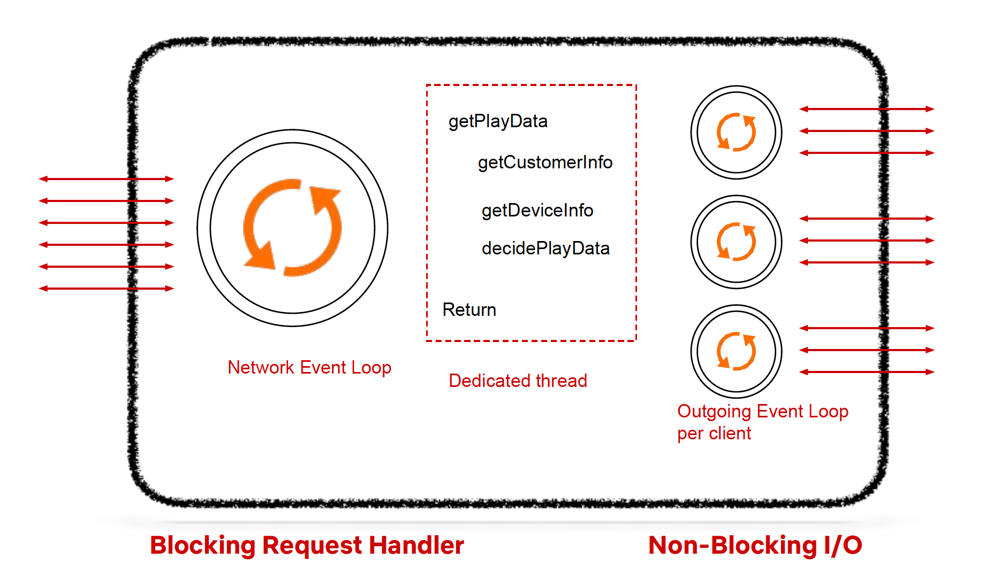
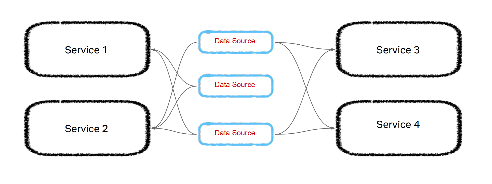
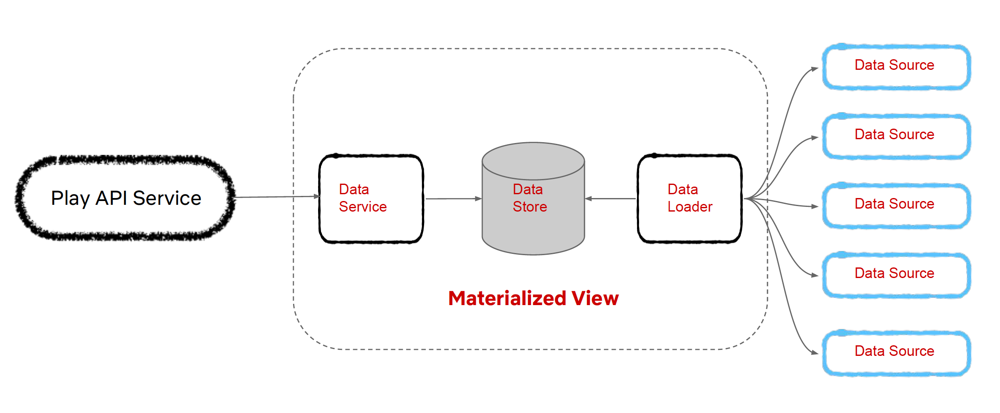
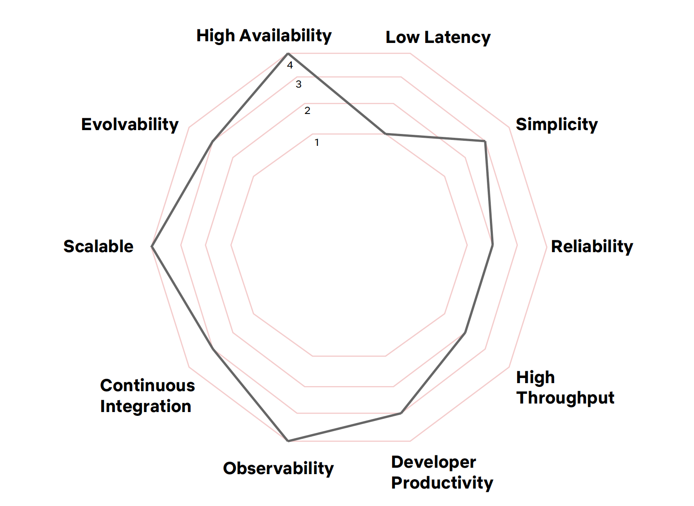

# Netflix Play API Case Study
{: .no_toc }
Presented on 9th April 2022 by [Jihyun](https://github.com/jihyun-um)

## Table of contents
{: .no_toc .text-delta }

1. TOC
{:toc}

# Identity

Ask yourself:
- Why does your service exist?
- If you remove your service from your ecosystem, what would be the impact?
- Does your service’s identity align with your company’s identity?

## Previous Architecture

- API Identity: Deliver Acquisition, Discovery and Playback functions with high availability.
- Did not follow the Single Responsibility Principle → Be wary of multiple-identities rolled up into a single service.

## Current Architecture

- Have one API service per function: Signup API, Discovery API, Playback API.
- Align with bigger organizations’ identities.
    - Netflix: Lead the Internet TV revolution to entertain billions of people across the world.
    - Product engineering: Maximize user engagement of Netflix customer from signup to streaming.
    - Edge engineering: Enable non-member, discovery, playback functionality 24/7.
    - Play API: Deliver playback lifecycle 24/7.
- The purpose of the Play API service is to orchestrate the playback life cycle, while providing stable abstractions between devices and on the domain specific playback services.

# Type 1/2 Decisions

## What Are Type 1/2 Decisions?

- Type 1 decisions: consequential, irreversible, or nearly irreversible decisions → one-way doors.
    - These decisions must be made methodically, carefully, slowly, with great deliberation and consultation.
- Type 2 decisions: changeable, reversible decisions → two-way doors.
    - These decisions should be made quickly by high judgement individuals or small groups.
- Identify your type 1 and type 2 decisions when designing an architecture.

## Three Type 1 Decisions to Consider

### Appropriate Coupling

There were some coupling problems with the previous architecture.

**1) Binary Coupling** 

- Thick shared libraries with 100s of dependent libraries (e.g. streaming utilities jar)
- Hundreds of shared libraries spanning services across network boundaries → “Distributed Monolith”
- Any fatal change in one of these libraries had the potential to bring multiple services down.

**2) Operational Coupling**

- Fallback logic in the playback decision client brought the service down when the playback decision service was unavailable.
- Via the playback decision client, the operational context of the playback decision service is leaking into the Play API Service.
- Many of the client libraries had the potential to bring down the API Service.

**3) Language Coupling**

- Most clients were only provided in Java, which made it difficult to choose another language.
- Most communications between services happened over REST over HTTP 1.1 → Unidirectional.

**Requirements for the New Architecture**

- Operationally “thin” clients
- No or limited shared libraries
- Auto-generated clients for Polyglot support
- Bi-Directional communication

**New Architecture**

### Synchronous & Asynchronous

**Typical Synchronous Architecture**

- In a typical synchronous architecture, you have a blocking request handler and a blocking client IO.
- There is a dedicated thread pool for all the incoming requests. Each request execution gets one dedicated thread.
- Each of the clients for external microservices have its own dedicated set of thread pools.
- When we get a request for getPlayData, it gets a thread from the Request Handler thread pool. The thread blocks until getPlayData returns.
- Within the getPlayData call, the first unit of execution is getCustomerInfo. It coordinates with a client thread pool that will correspond to the customer info and makes an outbound call to the customer service.
- For this entire duration, the execution thread is blocked till you get a response back from the customer service. The same thing happens with getDeviceInfo and decidePlayData.

**Asynchronous Architecture**

- There is an event loop for all the incoming communication → Requisition response event loop.
- There are a specific number of worker threads.
- There is an outgoing event loop associated with each of the client, which manages the outgoing communication.

**Netflix’s Decision: Synchronous Execution + Asynchronous I/O**

- If most of your APIs for the request response pattern consider a synchronous request handler, but ensure that your IO is non-blocking.

### Data Architecture

Without an intentional data architecture, data becomes its own monolith.

**Previous Data Architecture**

- Data sources are consumed by multiple services → Distributed Monolith.
- From within the scope of the API service, we have a subset of this data sources which we consume. And each of these data sources are loaded in memory asynchronously as and when the new data becomes available.
- Problems with previous data architecture:
    - A very small percentage of the data was actually getting used → Inefficient use of resources.
    - It became really non-trivial to unwind all the use cases for the data sources.
    - Whenever there was a data update, we could see that there was a correlated degradation and performance.

**Current Data Architecture**

- Instead of the Play API Service consuming these data sources directly, the Data Loader Service consumes all these data sources and all its refreshes.
- Whenever there is a new refresh of any of the data source, we would compute the data which is necessary for the Play API Service and will convert the original data source into a materialist view, which only the Play API Service needs, and we'll store that into the Data Store.
- We also created an abstraction layer for the Data Store, we call the Data Service. And it was a very highly available, highly cache, high throughput service, which enabled us to fetch all the data which is necessary in order to provide different business functions from within the Play API Service.

## Type 2 Decisions

- For Type 2 decisions, choose a path, experiment and iterate.
- Identify your Type 1 and Type 2 decisions; Spend 80% of your time debating and aligning on Type 1 Decisions.

# Evolvability

An Evolutionary Architecture supports guided and incremental change as first principle among multiple dimensions.

## Fitness Functions

- Use Fitness Functions to guide you for evolution and ensure that you are not breaking your original goals.
- Fitness Functions should be tailored for your particular business use case.

# Resources

- [[QCon 2018] Netflix Play API - An Evolutionary Architecture](https://www.infoq.com/presentations/netflix-play-api/)