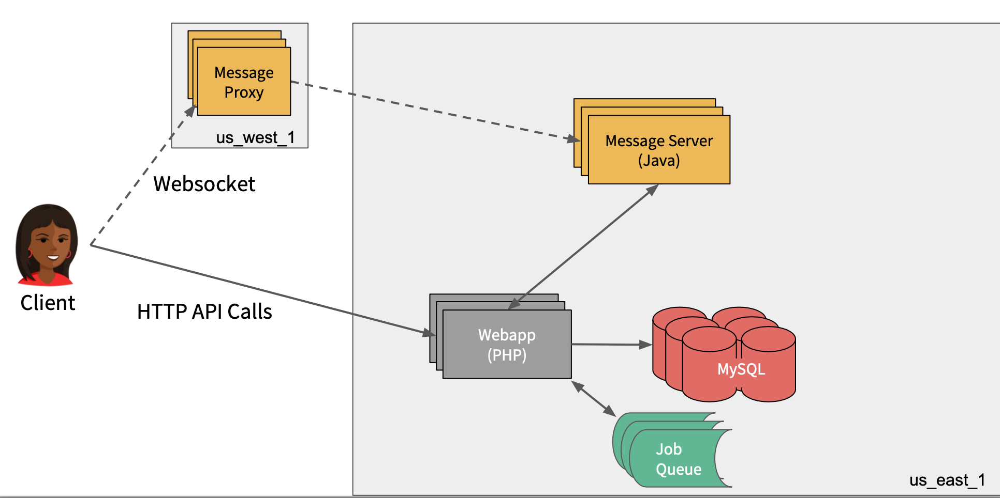
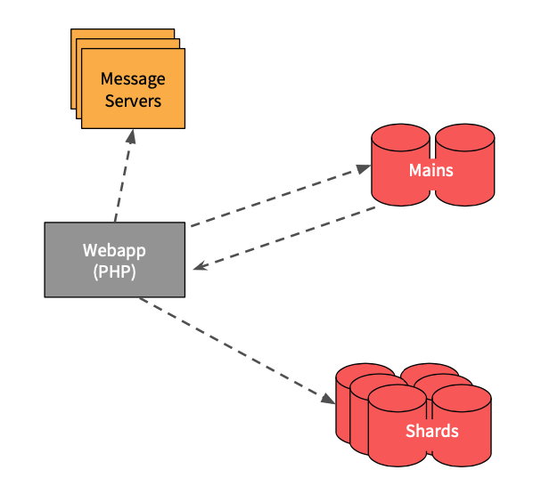
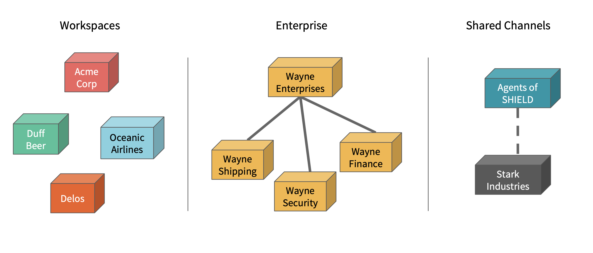
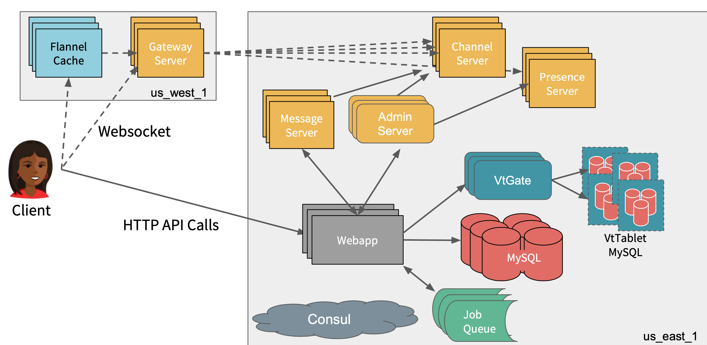

# Slack Architecture Case Study
{: .no_toc }

Presented on 27th Feb 2022 by [Jung](https://github.com/junglee1101)

## Table of contents
{: .no_toc .text-delta }

1. TOC
{:toc}

## Slack in 2016
----
### Slack Facts 

 - 4 million daily active users 

 - 2.5 million peak at that time 

 - organisations of around 10,000+ users 

### How Slack works 

(source: Resource 1)

- Client application made their interactions with the big PHP monolith which is hosted in Amazon's US East Data Centre. The PHP Server is backed by MySQL database tier.

- There is an asynchronous job queue system where Slack defer activities like unfurling links, or indexing message sfor search would get pushed out to that tier. 

- The real time message stock built in a Java tier where all of the pub/sub distribution of the messaging product happened. 

- Message proxy is outside of US-East data centre, which is responsible for edge terminiationg SSL and proxying that WebSocket connection over the WAN back to US East. 

*SSL Termation: Decrypting encrypted traffic before passing along to a web server.*

### Client / Server Flow 

- the client makes this API call rtm.start(real time messaging) to the PHP backend, which would download the entire workspace model.

- So every user, all of their preferences, profiles, avatars, every channel and all the information of the channel get dumped to the client and the client would populate a model and vision of the metadata of the team.

- Also, as part of that initial payload, a URL is also received which the client will then use to connect to a WebSocket to the nearby message proxy that would then go back to the message server.

### Sharding And Routing 

(source: Resource 1)

- The backend was scaled out horizontally by straightforward sharding approach.

- One workspace assigns to a particular database shard and a message server shard.

- The first API will look up the metadata row from this Database tier that got called the Mains (the key initial bootstrapping tier) which will respond back with the specific DB and MS shard the client can route to. 

- Database and MS shards are managed as a herd of pets - each server is known by a number.

- Slack has two MySQL hosts running as active/active and master/master replication between them. This means each side was available for writes and they would replicate across them to increase site availability while sacrificing some consistency.

## Slack in 2018
----
There is increase in scale for the site and increase of usages which eventually changed the product model to suit the need.

### Slack Facts (2018)

- 8 million daily active user for the product (doubled our user base)

- More than 7 million of which are connected at any one time (tripled compare to 2016)

- organisations of more than 125,000 users (10 times increased the size of the largest organisations)

### Change the Model 

(source: Resource 1)

- Introduction of the enterprise product of Slack
   - Enterprise can have separate Slack workspaces for each subdivision or geolocation
   - Local teams have their own control over their channels and their preferences.
   - Each workspace has its own notion in the backend, database shards and MS shard.
 
- New feature of shared channels
   - separate organisational entities can have a shared channel between them for collaboration.
   - channels no longer belong to one workspace.

## What did slack do? 

There are 3 main changes that Slack implemented to cope with the increased number of users and new features to adapt clients' need. 

### Thin Client Model 

- Introduced a caching service called **Flannel** that allowed to slim down the initial boot payload.

- with the 2016 model, if an organisation has more than 100,000 users, each user will have to download ~100MB every time they log into their slack workspace.

- Flannel is deployed nearer to the client, so it connects the WebSocket to a nearby Flannel Cache which proxies the connection to the message proxy and then to that route pub/sub message server.

- Flannel acts as a man in the middle between the backend and front end so it has the in-memory model of all the users, which can inject the metadata in line to the websocket stream if the client doesn't have a user ID or a channel ID.

### Vitess

- In order to spread the load out more efficiently, Slack started to use the database technology called **Vitess**.

- **Vitess** runs MySQL at the core and so it is a sharding and topology management solution that sits on top of MySQL.

- In **Vitesss**, the application is connected to a routing tier called VtGate where it acts as a routing server as it knows which set of backend servers are hosting those tables and it knows which column a given table is sharded by.

- The Database would be sharded by the user ID, channel ID and workspace ID. Thus, all of that knowledge is no longer in our PHP code.

- **VtGate** is responsible for disseminating and doing all of the routing. it can also scatter and gather requests from multiple shards. 

- In **Vitess**, we have a single writable master and we reploy on orchestrator which manage the fail. 

### Message Server to Services 

- The original message server is built with the idea that a single MS had all of the data for a given workspace. It managed all of the pub-sub interactions for every channel, all of the metadata updates for every user.
 
- Previous model would not work with the new product model(shared channel), so the model had to be refactored in order to provide the new service.
 
- The message server system into five main cooperating services - Gateway server, Admin server, Presence Server, legacy Message Server and Channel Server.
 
- Gateway Server replaces the message proxy box which manages subscriptions to a number of channel servers that are responsible for the call, core and publish subscribe system,
 
- Administrative service tier is responsible for maintaining the cluster topology
 
- Presence Server tier that's responsible for distributing in four main circles.
 
- Legacy system is still around to support reminders and google calendar integration.

(source: Resource 1)

## Resources 
1. [Scaling Slack](https://www.infoq.com/presentations/slack-scalability-2018/)
2. [How slack works](https://www.infoq.com/presentations/slack-infrastructure/)
